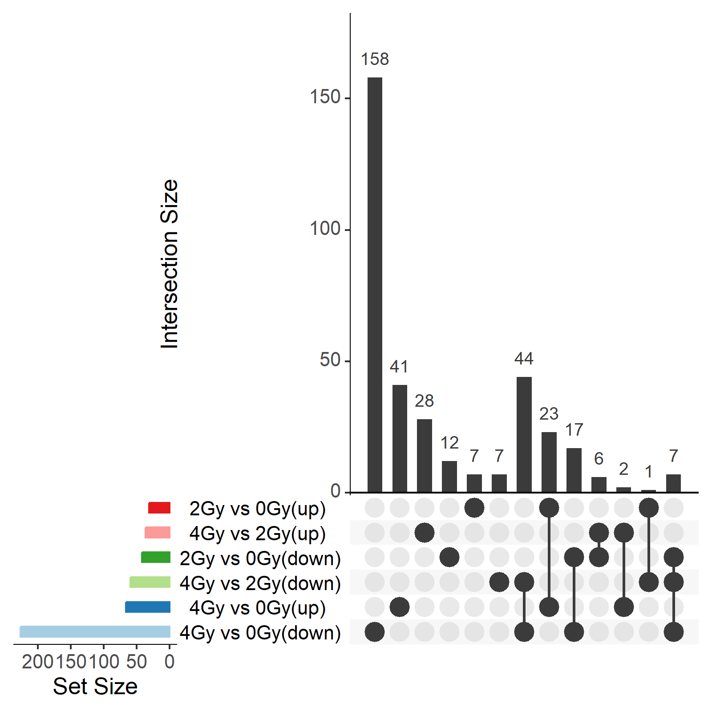

```{r setup, include=FALSE}
knitr::opts_chunk$set(echo = TRUE)
```

```{r library, include=FALSE}
library(readr)
library(tidyverse)
library(ggrepel)
library(patchwork)
library(grid)
library(pheatmap)
library(scales)
library(conflicted)
library(recount3)
library(DESeq2)
library(ashr)
library(EnhancedVolcano)
library(PCAtools)
library(cowplot)
library(ggplotify)
library(VennDetail)
library(enrichR)
library(KEGGREST)
library(pathview)
library(biomaRt)

walk(c("select", "filter", "count", "rename"), ~ conflict_prefer(.x, "dplyr")) # walk з purr
```

```{r data}
# Список проєктів у кеші
projects <- recount3::available_projects()

# Завантаження проєкту з хмари або з кешу
if ("SRP174505" %in% projects) {
  rse <- recount3::create_rse_manual(
    project = "SRP174505",
    project_home = "data_sources/sra",
    organism = "human",
    annotation = "gencode_v26",
    type = "gene"
  )
  
} else {
  rse <- recount3::create_rse_manual(
    project = "SRP174505",
    project_home = "data_sources/sra",
    organism = "human",
    annotation = "gencode_v26",
    type = "gene"
  )
}

rse
rse_filtered <- rse[rowData(rse)$gene_type == "protein_coding", ]
```

```{r rse export}
rse_colData<- as.data.frame(colData(rse))
rse_rowData<- as.data.frame(rowData(rse))
rse_assay <- as.data.frame(assay(rse))
rse_colData_f<- as.data.frame(colData(rse_filtered))
rse_rowData_f<- as.data.frame(rowData(rse_filtered))
rse_assay_f <- as.data.frame(assay(rse_filtered))
gene_annotations <- as.data.frame(rowData(rse_filtered)[c("gene_id", "gene_name")])
#gene_annotations_unique <- gene_annotations[!duplicated(gene_annotations$gene_name), ]
make_unique_names <- function(df, id_col, name_col) {
  df %>%
    rownames_to_column(var = id_col) %>%
    left_join(gene_annotations, by = id_col) %>%
    mutate(!!name_col := ifelse(is.na(.data[[name_col]]), .data[[id_col]], .data[[name_col]])) %>%
    mutate(!!name_col := make.unique(as.character(.data[[name_col]]))) %>%
    column_to_rownames(var = name_col)
}

write_delim(rse_colData, "./data/rse_colData.csv", delim = ";", col_names = TRUE)
write_delim(rse_rowData, "./data/rse_rowData.csv", delim = ";", col_names = TRUE)
write_delim(rse_assay, "./data/rse_assay.csv", delim = ";", col_names = TRUE)
write_delim(rse_colData_f, "./data/rse_colData_filtered.csv", delim = ";", col_names = TRUE)
write_delim(rse_rowData_f, "./data/rse_rowData_filtered.csv", delim = ";", col_names = TRUE)
write_delim(rse_assay_f, "./data/rse_assay_filtered.csv", delim = ";", col_names = TRUE)
```

 Колонка "sra.sample_title" вказує на зразки, які є контрольними (0Gy) та ті, що зазнали опромінення (2Gy, 4Gy).
```{r pre-analysis visualisation}
# Створення таблиці метаданих
colData_new <- data.frame(
  row.names = colnames(rse_filtered),
  condition = factor(c(rep("0Gy", 3), rep("2Gy", 3), rep("4Gy", 3)))
)

# Матриця counts
countData <- assay(rse_filtered)

# Побудова графіку щільності
p1 <- ggplot(countData, aes(x = SRR8371688 )) +
  geom_density(color = "darkblue", fill = "lightblue")

count_summary <- countData |>
  as.vector() |>
  data.frame(counts = _) |>
  group_by(counts) |>
  summarise(frequency = n(), .groups = 'drop') |>
  arrange(counts)


# Створення гістограми частоти значень
p2 <- ggplot(count_summary[1:200,], aes(x = counts, y = frequency, fill = frequency)) +
  geom_bar(stat = "identity", width = 0.7) +
  scale_y_log10(labels = scales::comma) +
  labs(title = "Histogram of Counts vs Frequency (Logarithmic Scale)",
       x = "Counts",
       y = "Frequency (log10)") +
  scale_fill_gradient(low = "#AA05BA", high = "#56B1F7") +
  theme_minimal()
p1
p2
counts_info <- p1 + p2

ggsave("./figs/counts_info.png", plot = counts_info, width = 16, height = 6, dpi = 300)
```

```{r deseq}
# Створіть DESeqDataSet
dds <- DESeqDataSetFromMatrix(countData = countData,
                              colData = colData_new,
                              design = ~ condition)
dds <- dds[apply(counts(dds), 1, function(row) all(row > 5)), ]
vsd <- vst(dds, blind = FALSE)

# Отримання матриці нормалізованих значень
vst_data <- assay(vsd)
```

Differential testing: multigroup
```{r}
dds_wald <- dds[rowSums(counts(dds)) > 0, ]

dds_wald <- DESeq(dds, test="Wald")
res_wald <- results(dds_wald)

#res_wald$padj <- p.adjust(res_wald$pvalue, method = "fdr")

res_sig_wald  <- res_wald[which(res_wald$padj < 0.05 & abs(res_wald$log2FoldChange) > 1.5), ]

res_wald_df <- as.data.frame(res_sig_wald )

# Додавання груп, виходячи з напрямку log2FoldChange
res_wald_df$condition <- ifelse(res_wald_df$log2FoldChange > 0, "Upregulated", "Downregulated")

# Побудова MA-графіка
pl2 <- ggplot(res_wald_df, aes(x = baseMean, y = log2FoldChange, color = condition)) +
  geom_point(alpha = 0.4, size = 1.5) +
  scale_x_log10() + 
  labs(x = "Mean of Normalized Counts", y = "Log2 Fold Change") +
  theme_minimal() +
  scale_color_manual(values = c("Upregulated" = "red", "Downregulated" = "blue")) +
  theme(
    legend.title = element_blank(),
    plot.background = element_rect(fill = "white"),
    panel.background = element_rect(fill = "white"))
pl2
ggsave("./figs/deseq_wald_test.png", plot = pl2, width = 16, height = 6, dpi = 300)
```

```{r}
res_wald_2Gy_vs_0Gy <- results(dds_wald, contrast = c("condition", "2Gy", "0Gy"))
res_wald_2Gy_vs_0Gy$padj <- p.adjust(res_wald$pvalue, method = "fdr")
res_wald_4Gy_vs_0Gy <- results(dds_wald, contrast = c("condition", "4Gy", "0Gy"))
res_wald_4Gy_vs_0Gy$padj <- p.adjust(res_wald$pvalue, method = "fdr")
res_wald_4Gy_vs_2Gy <- results(dds_wald, contrast = c("condition", "4Gy", "2Gy"))
res_wald_4Gy_vs_2Gy$padj <- p.adjust(res_wald$pvalue, method = "fdr")

hist_data <- bind_rows(
  data.frame(padj = res_wald_2Gy_vs_0Gy$padj, Comparison = "2Gy vs 0Gy"),
  data.frame(padj = res_wald_4Gy_vs_0Gy$padj, Comparison = "4Gy vs 0Gy"),
  data.frame(padj = res_wald_4Gy_vs_2Gy$padj, Comparison = "4Gy vs 2Gy")
)

# Побудова графіка
ggplot(hist_data, aes(x = padj, fill = Comparison, color = Comparison)) +
  geom_density(alpha = 0.2, adjust = 1.5) + # Криві густини
  scale_fill_manual(values = c("2Gy vs 0Gy" = "red", "4Gy vs 0Gy" = "blue", "4Gy vs 2Gy" = "forestgreen")) +
  scale_color_manual(values = c("2Gy vs 0Gy" = "red", "4Gy vs 0Gy" = "blue", "4Gy vs 2Gy" = "forestgreen")) +
  labs(title = "Розподіл коригованих p-значень", x = "p-значення", y = "Щільність") +
  geom_vline(xintercept = 0.05, linetype = "dashed", color = "black") + # Вертикальна лінія
  theme_minimal()

ggplot(hist_data, aes(x = padj, fill = Comparison)) +
  geom_histogram(position = "dodge", binwidth = 0.01, color = "black", alpha = 0.7) +
  scale_fill_manual(values = c("2Gy vs 0Gy" = "red", "4Gy vs 0Gy" = "blue", "4Gy vs 2Gy" = "green")) +
  labs(title = "Розподіл коригованих p-значень", x = "p-значення", y = "Частота") +
  geom_vline(xintercept = 0.05, linetype = "dashed", color = "black") + # Вертикальна лінія
  theme_minimal()
```


```{r deseq visualization Wald}

png("./figs/deseq_Wald_padj.png", width = 2400, height = 800)
par(mfrow = c(1, 3), mar = c(5, 5, 4, 2))
hist(res_wald_2Gy_vs_0Gy$padj, col = "grey50", border = "white", main = "2Gy vs 0Gy", xlab = "p-values")
hist(res_wald_4Gy_vs_0Gy$padj, col = "grey50", border = "white", main = "4Gy vs 0Gy", xlab = "p-values")
hist(res_wald_4Gy_vs_2Gy$padj, col = "grey50", border = "white", main = "4Gy vs 2Gy", xlab = "p-values")
dev.off()
knitr::include_graphics("./figs/deseq_Wald_padj.png")

png("./figs/deseq_Wald.png", width = 2400, height = 800)
par(mfrow = c(1, 3), mar = c(5, 5, 4, 2))

plotMA(res_wald_2Gy_vs_0Gy, ylim=c(-30,30), main="MA-plot: 0Gy vs 2Gy")
plotMA(res_wald_4Gy_vs_0Gy, ylim=c(-30,30), main="MA-plot: 0Gy vs 4Gy")
plotMA(res_wald_4Gy_vs_2Gy, ylim=c(-30,30), main="MA-plot: 2Gy vs 4Gy")
dev.off()
knitr::include_graphics("./figs/deseq_Wald.png")

res_wald_df_2Gy_vs_0Gy <- as.data.frame(res_wald_2Gy_vs_0Gy)
res_wald_df_2Gy_vs_0Gy$significant <- res_wald_df_2Gy_vs_0Gy$padj < 0.05

res_wald_df_4Gy_vs_0Gy <- as.data.frame(res_wald_4Gy_vs_0Gy)
res_wald_df_4Gy_vs_0Gy$significant <- res_wald_df_4Gy_vs_0Gy$padj < 0.05

res_wald_df_4Gy_vs_2Gy <- as.data.frame(res_wald_4Gy_vs_2Gy)
res_wald_df_4Gy_vs_2Gy$significant <- res_wald_df_4Gy_vs_2Gy$padj < 0.05

res_wald_df_2Gy_vs_0Gy$comparison <- "2Gy vs 0Gy"
res_wald_df_4Gy_vs_0Gy$comparison <- "4Gy vs 0Gy"
res_wald_df_4Gy_vs_2Gy$comparison <- "4Gy vs 2Gy"

res_wald_df_2Gy_vs_0Gy <- as.data.frame(res_wald_df_2Gy_vs_0Gy)  |> 
  mutate(gene_id = rownames(res_wald_df_2Gy_vs_0Gy), comparison = "2Gy vs 0Gy")  |> 
  left_join(gene_annotations, by = "gene_id")

# Оновлення res_df_4Gy_vs_0Gy
res_wald_df_4Gy_vs_0Gy <- as.data.frame(res_wald_df_4Gy_vs_0Gy)  %>% 
  mutate(gene_id = rownames(.), comparison = "4Gy vs 0Gy")  |> 
  left_join(gene_annotations, by = "gene_id")

# Оновлення res_df_4Gy_vs_2Gy
res_wald_df_4Gy_vs_2Gy <- as.data.frame(res_wald_df_4Gy_vs_2Gy)  |> 
  mutate(gene_id = rownames(res_wald_df_4Gy_vs_2Gy), comparison = "4Gy vs 2Gy")  |> 
  left_join(gene_annotations, by = "gene_id")

# Побудова volcano plot
plot_2Gy_vs_0Gy_W <- EnhancedVolcano(res_wald_df_2Gy_vs_0Gy,
                                   lab = res_wald_df_2Gy_vs_0Gy$gene_name,
                                   x = 'log2FoldChange',
                                   y = 'padj',
                                   xlim = c(-5, 5),
                                   ylim = c(0, 10),
                                   pCutoff = 0.05,
                                   FCcutoff = 1.5,
                                   pointSize = 1.5,
                                   labSize = 2.0,
                                   col = c('grey30', 'forestgreen', 'royalblue', 'red2'),
                                   title = '2Gy vs 0Gy',
                                   legendPosition = 'top')

plot_4Gy_vs_0Gy_W <- EnhancedVolcano(res_wald_df_4Gy_vs_0Gy,
                                   lab = res_wald_df_4Gy_vs_0Gy$gene_name,
                                   x = 'log2FoldChange',
                                   y = 'padj',
                                   xlim = c(-5, 5),
                                   ylim = c(0, 10),
                                   pCutoff = 0.05,
                                   FCcutoff = 1.5,
                                   pointSize = 1.5,
                                   labSize = 2.0,
                                   col = c('grey30', 'forestgreen', 'royalblue', 'red2'),
                                   title = '4Gy vs 0Gy',
                                   legendPosition = 'top')

plot_4Gy_vs_2Gy_W <- EnhancedVolcano(res_wald_df_4Gy_vs_2Gy,
                                   lab = res_wald_df_4Gy_vs_2Gy$gene_name,
                                   x = 'log2FoldChange',
                                   y = 'padj',
                                   xlim = c(-5, 5),
                                   ylim = c(0, 10),
                                   pCutoff = 0.05,
                                   FCcutoff = 1.5,
                                   pointSize = 1.5,
                                   labSize = 2.0,
                                   col = c('grey30', 'forestgreen', 'royalblue', 'red2'),
                                   title = '4Gy vs 2Gy',
                                   legendPosition = 'top')
volc_wald_plot <- plot_2Gy_vs_0Gy_W + plot_4Gy_vs_0Gy_W + plot_4Gy_vs_2Gy_W + plot_layout(nrow = 1)

print(volc_wald_plot)
ggsave("./figs/volc_wald.png", plot = volc_wald_plot, width = 20, height = 6, dpi = 300)
```

```{r upset}
res_2Gy_0Gy_up <- res_wald_df_2Gy_vs_0Gy |> as.data.frame() |> filter(pvalue < 0.05 & log2FoldChange > 1.5)
res_2Gy_0Gy_down <- res_wald_df_2Gy_vs_0Gy  |> as.data.frame() |> filter(pvalue < 0.05 & log2FoldChange < -1.5)
res_4Gy_0Gy_up <- res_wald_df_4Gy_vs_0Gy  |> as.data.frame() |> filter(pvalue < 0.05 & log2FoldChange > 1.5)
res_4Gy_0Gy_down <- res_wald_df_4Gy_vs_0Gy  |> as.data.frame() |> filter(pvalue < 0.05 & log2FoldChange < -1.5)
res_4Gy_2Gy_up <- res_wald_df_4Gy_vs_2Gy |> as.data.frame() |> filter(pvalue < 0.05 & log2FoldChange > 1.5)
res_4Gy_2Gy_down <- res_wald_df_4Gy_vs_2Gy  |> as.data.frame() |> filter(pvalue < 0.05 & log2FoldChange < -1.5)

venn_list <- list("2Gy vs 0Gy(up)" = res_2Gy_0Gy_up$gene_name,
                  "2Gy vs 0Gy(down)" = res_2Gy_0Gy_down$gene_name,
                  "4Gy vs 0Gy(up)" = res_4Gy_0Gy_up$gene_name,
                  "4Gy vs 0Gy(down)" = res_4Gy_0Gy_down$gene_name,
                  "4Gy vs 2Gy(up)" = res_4Gy_2Gy_up$gene_name,
                  "4Gy vs 2Gy(down)" = res_4Gy_2Gy_down$gene_name)

ven <- venndetail(venn_list)

png("./figs/venn_diagram.png", width = 1600, height = 1600, res = 300)
plot(ven, type = "upset")
dev.off()

```


```{r PCA}

vst_data <- assay(vst(dds_wald))

pca_result <- PCAtools::pca(vst_data, metadata = colData_new, removeVar = 0.1)

horn <- parallelPCA(vst_data)
elbow <- findElbowPoint(pca_result$variance)
var_explained <- which(cumsum(pca_result$variance)> 80)[1]

pscree <- PCAtools::screeplot(pca_result,
    axisLabSize = 18,
    titleLabSize = 22,
    vline = c(horn$n, elbow, var_explained), hline = 85,
    returnPlot = FALSE) +
    geom_label(aes(x = horn$n, y = 60,
      label = 'Horn\'s', vjust = -1, size = 8)) +
    geom_label(aes(x = elbow, y = 60,
      label = 'Elbow method', vjust = -3, size = 8)) +
    geom_label(aes(x = var_explained , y = 85,
      label = '80% explained variation', vjust = -1, size = 8)) 


ppairs <- PCAtools::pairsplot(pca_result,
    hline = 0, vline = 0,
    pointSize = 2,
    gridlines.major = FALSE, gridlines.minor = FALSE,
    colby = 'condition',
    plotaxes = TRUE,
    margingaps = unit(c(0.01, 0.01, 0.01, 0.01), 'cm'),
    returnPlot = FALSE)


# Створюємо нові назви для рядків, зіставляючи gene_id з gene_name
new_row_names <- gene_annotations$gene_name[match(rownames(pca_result$loadings), gene_annotations$gene_id)]

# Якщо є дублікат імен, додамо індекси для унікальності
new_row_names <- make.unique(new_row_names)

# Перезаписуємо назви рядків у pca_result$loadings
rownames(pca_result$loadings) <- new_row_names


pbiplot <- PCAtools::biplot(pca_result,
    axisLabSize = 18,
    # loadings parameters
    showLoadings = TRUE,
    sizeLoadingsNames = 4,
    colLoadingsNames = 'red4',
    #points
    lab = NULL,
    colby = 'condition',
    colLegendTitle = 'Condition',
    colkey = c('0Gy' = '#228B22', '2Gy' = '#7B68EE', '4Gy' = '#FF8C00'),
    pointSize = 5,
    #plotview
    hline = 0,
    vline = c(-5, 0, 5),
    vlineType = c('dotdash', 'solid', 'dashed'),
    gridlines.major = FALSE, gridlines.minor = FALSE,
    legendPosition = 'right', 
    legendLabSize = 16,
    legendIconSize = 8.0,,
    subtitle = 'PC1 versus PC2',
    caption = '5 PCs ≈ 80%',
    returnPlot = FALSE)

ploadings <- PCAtools::plotloadings(pca_result,
    axisLabSize = 18,
    subtitle = 'PC1, PC2, PC3, PC4, PC5',
    labSize = 3,
    returnPlot = FALSE)


# Використовуємо більше компонент для кластеризації, наприклад, перші 5
set.seed(1234)
km <- kmeans(x = pca_df[, 1:5], centers = 3, nstart = 25)  # Використовуємо 5 компонент і 25 запусків

# Додаємо результати кластеризації в датафрейм
pca_df$cluster <- as.factor(km$cluster)

# Візуалізація
pkmean <- autoplot(km, data = pca_df, frame = TRUE, frame.type = 'norm', size = 4, alpha = 0.6) + 
  aes(shape = condition, color = cluster) + 
  scale_shape_manual(values = c('0Gy' = 16, '2Gy' = 17, '4Gy' = 18)) + 
  labs(subtitle = 'with 5 PCs',
       color = 'cluster', shape = 'Condition') +
  coord_equal() + 
  theme_minimal(base_size = 18)+
  theme(legend.position = 'right', # Позиція легенди
        panel.border = element_rect(color = 'black', fill = NA, size = 1))  # Додання рамки

library(patchwork)

# Додаємо заголовки до кожного графіка
pscree <- pscree + ggtitle("A Scree plot") + theme(plot.title = element_text(face = "bold", hjust = -0.01, size = 18))
ploadings <- ploadings + ggtitle("B Loading plot") + theme(plot.title = element_text(face = "bold", hjust = -0.01, size = 18))
pbiplot <- pbiplot + ggtitle("C Bi-plot") + theme(plot.title = element_text(face = "bold", hjust = -0.01, size = 18))
pkmean <- pkmean + ggtitle("D K-means Clusters") + theme(plot.title = element_text(face = "bold", hjust = -0.01, size = 18))
ppairs <- ppairs + ggtitle("E Pairs plot") + theme(plot.title = element_text(face = "bold", hjust = 0.5, size = 18))

# Комбінування графіків у сітку
combined_plot <- (pscree | ploadings) / (pbiplot | pkmean) / ppairs


ggsave("./figs/combined_plot.png", combined_plot, width = 20, height = 30)

knitr::include_graphics("./figs/combined_plot.png")
```

```{r enrichr}
dbs <- listEnrichrDbs()
print(head(dbs))

databases <- c("KEGG_2021_Human", "GO_Biological_Process_2021", "Reactome_2022", "WikiPathways_2023_Human")

enrichr_results_2Gy_0Gy_up <- enrichr(res_2Gy_0Gy_up$gene_name, databases)
enrichr_results_4Gy_0Gy_up <- enrichr(res_4Gy_0Gy_up$gene_name, databases)
enrichr_results_4Gy_2Gy_up <- enrichr(res_4Gy_2Gy_up$gene_name, databases)
enrichr_results_all_up <- enrichr(unique(c(res_2Gy_0Gy_up$gene_name, res_4Gy_0Gy_up$gene_name, res_4Gy_2Gy_up$gene_name)), databases)

head(enrichr_results_2Gy_0Gy_up)
head(enrichr_results_4Gy_0Gy_up)
head(enrichr_results_4Gy_2Gy_up)
head(enrichr_results_all_up)

# # Збереження результатів у CSV-файли
# write.csv(enrichr_results_2Gy_0Gy_up, "./data/enrichr_results_2Gy_vs_0Gy_up.csv")
# write.csv(enrichr_results_4Gy_0Gy_up, "./data/enrichr_results_4Gy_vs_0Gy_up.csv")
# write.csv(enrichr_results_4Gy_2Gy_up, "./data/enrichr_results_4Gy_vs_2Gy_up.csv")

# Функція для підготовки даних і побудови графіка
plot_enrichr_barplot <- function(enrichr_result, title) {
  # Перетворюємо список результатів в датафрейм
  enrichr_result_df <- as.data.frame(enrichr_result[[1]])
  
  # Перетворення колонки Overlap з формату "x/y" в числовий (беремо перше число x)
  enrichr_result_df$Gene_number <- sapply(enrichr_result_df$Overlap, function(x) as.numeric(strsplit(x, "/")[[1]][1]))
  
  # Додаємо назви генів у дужках до терміна
  enrichr_result_df$Term <- paste0(enrichr_result_df$Term, " (", enrichr_result_df$Genes, ")")
  
  # Переконаємося, що є дані для побудови
  if (nrow(enrichr_result_df) > 0) {
    p <- ggplot(enrichr_result_df, aes(x = reorder(Term, Gene_number), 
                                  y = Gene_number, 
                                  fill = -log10(as.numeric(Adjusted.P.value)))) +
      geom_bar(stat = "identity", width = 0.5, alpha = 0.8) +
      coord_flip() +
      labs(title = title, 
           x = "Biological Process", 
           y = "Gene Number",
           fill = "-log10(Adjusted P.value)") +
      scale_fill_viridis_c(option = "inferno")  +
      theme_minimal() +
      theme(axis.text.y = element_text(size = 7),  # Розмір шрифта для заголовка легенди
            plot.margin = margin(10, 10, 10, 10),   # Збільшити відступи навколо графіка
            panel.background = element_rect(fill = "white"), # Білий фон панелі
            plot.background = element_rect(fill = "white"),  # Білий фон графіка
            panel.grid.major = element_line(color = "gray90"), # Колір основних сіток
            panel.grid.minor = element_line(color = "gray95"))  # Зменшити розмір шрифта на осі Y
    return(p)
  } else {
    print(paste("Немає даних для графіка:", title))
    return(NULL)
  }
}

# Побудуємо графіки для кожного результату
enrichr_results_2Gy_0Gy_up <- plot_enrichr_barplot(enrichr_results_2Gy_0Gy_up, "Enrichr: 2Gy vs 0Gy")
enrichr_results_4Gy_0Gy_up <- plot_enrichr_barplot(enrichr_results_4Gy_0Gy_up, "Enrichr: 4Gy vs 0Gy")
enrichr_results_4Gy_2Gy_up <- plot_enrichr_barplot(enrichr_results_4Gy_2Gy_up, "Enrichr: 4Gy vs 2Gy")
enrichr_results_all_up <- plot_enrichr_barplot(enrichr_results_all_up, "Enrichr: All Comparisons")

ggsave("./figs/enrichr_results_2Gy_0Gy_up.png", plot = enrichr_results_2Gy_0Gy_up, width = 20, height = 20, dpi = 300)
ggsave("./figs/enrichr_results_4Gy_0Gy_up.png", plot = enrichr_results_4Gy_0Gy_up, width = 20, height = 20, dpi = 300)
ggsave("./figs/enrichr_results_4Gy_2Gy_up.png", plot = enrichr_results_4Gy_2Gy_up, width = 20, height = 20, dpi = 300)
ggsave("./figs/enrichr_results_all_up.png", plot = enrichr_results_all_up, width = 20, height = 20, dpi = 300)
```


```{r}
path_4Gy_vs_0Gy <- res_wald_df_4Gy_vs_0Gy  |> as.data.frame() |> filter(pvalue < 0.05 & abs(log2FoldChange) > 1.5)


# Отримуємо основні ENSEMBL IDs без версій і додаємо їх до DataFrame
path_4Gy_vs_0Gy$genes_of_interest <- gsub("\\..*", "", path_4Gy_vs_0Gy$gene_id)

# Встановлюємо біо-ресурс
ensembl <- useMart("ensembl", dataset = "hsapiens_gene_ensembl")

# Отримуємо Entrez IDs для основних ENSEMBL IDs
entrez_ids <- getBM(attributes = c('ensembl_gene_id', 'entrezgene_id'),
                    filters = 'ensembl_gene_id',
                    values = path_4Gy_vs_0Gy$genes_of_interest,
                    mart = ensembl)

# Об'єднуємо Entrez IDs з вашим DataFrame
path_4Gy_vs_0Gy <- merge(path_4Gy_vs_0Gy, entrez_ids, by.x = "genes_of_interest", by.y = "ensembl_gene_id", all.x = TRUE)


# Перевіряємо результати
head(path_4Gy_vs_0Gy)

```

```{r}
logFC <- path_4Gy_vs_0Gy$log2FoldChange
names(logFC) <- path_4Gy_vs_0Gy$entrezgene_id


pathview(gene.data = logFC, 
         pathway.id = "hsa05207", 
         species = "hsa", 
         #kegg.native = T
         ut.suffix = "Non-small cell lung cancer (специфічно для A549)")
knitr::include_graphics("hsa05207.pathview.png")

pathview(gene.data = logFC, 
         pathway.id = "hsa04110", 
         species = "hsa", 
         #kegg.native = T
         ut.suffix = "Cell cycle")
knitr::include_graphics("hsa04110.pathview.png")

pathview(gene.data = logFC, 
         pathway.id = "hsa04115", 
         species = "hsa", 
         #kegg.native = T
         ut.suffix = "p53 signaling pathway")
knitr::include_graphics("hsa04115.pathview.png")
```

```{r}
pathview(gene.data = logFC, 
         pathway.id = "hsa04725", 
         species = "hsa", 
         #kegg.native = T
         ut.suffix = "NAChR")
knitr::include_graphics("hsa04725.pathview.png")

pathview(gene.data = logFC, 
         pathway.id = "hsa04210", 
         species = "hsa", 
         #kegg.native = T
         ut.suffix = "Apoptosis")
knitr::include_graphics("hsa04210.pathview.png")

```


