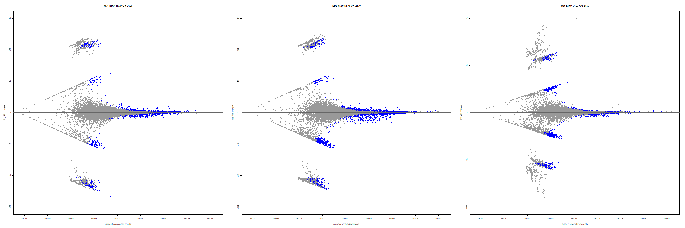
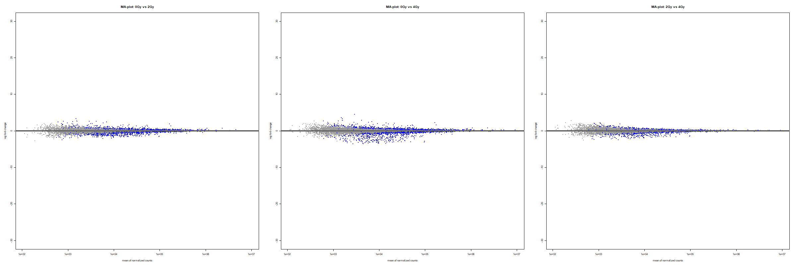

```{r setup, include=FALSE}
knitr::opts_chunk$set(echo = TRUE)
```

```{r library, include=FALSE}
library(readr)
library(tidyverse)
library(ggrepel)
library(patchwork)
library(grid)
library(pheatmap)
library(scales)
library(conflicted)
library(recount3)
library(DESeq2)
library(ashr)
library(EnhancedVolcano)

walk(c("select", "filter", "count", "rename"), ~ conflict_prefer(.x, "dplyr")) # walk з purr
```

```{r data}
# Список проєктів у кеші
projects <- recount3::available_projects()

# Завантаження проєкту з хмари або з кешу
if ("SRP174505" %in% projects) {
  rse <- recount3::create_rse_manual(
    project = "SRP174505",
    project_home = "data_sources/sra",
    organism = "human",
    annotation = "gencode_v26",
    type = "gene"
  )
  
} else {
  rse <- recount3::create_rse_manual(
    project = "SRP174505",
    project_home = "data_sources/sra",
    organism = "human",
    annotation = "gencode_v26",
    type = "gene"
  )
}

rse
rse_filtered <- rse[rowData(rse)$gene_type == "protein_coding", ]
```
```{r rse export}
rse_colData<- as.data.frame(colData(rse))
rse_rowData<- as.data.frame(rowData(rse))
rse_assay <- as.data.frame(assay(rse))
rse_colData_f<- as.data.frame(colData(rse_filtered))
rse_rowData_f<- as.data.frame(rowData(rse_filtered))
rse_assay_f <- as.data.frame(assay(rse_filtered))
gene_annotations <- as.data.frame(rowData(rse_filtered)[c("gene_id", "gene_name")])
gene_annotations_unique <- gene_annotations[!duplicated(gene_annotations$gene_name), ]
make_unique_names <- function(df, id_col, name_col) {
  df %>%
    rownames_to_column(var = id_col) %>%
    left_join(gene_annotations, by = id_col) %>%
    mutate(!!name_col := ifelse(is.na(.data[[name_col]]), .data[[id_col]], .data[[name_col]])) %>%
    mutate(!!name_col := make.unique(as.character(.data[[name_col]]))) %>%
    column_to_rownames(var = name_col)
}

write_delim(rse_colData, "./data/rse_colData.csv", delim = ";", col_names = TRUE)
write_delim(rse_rowData, "./data/rse_rowData.csv", delim = ";", col_names = TRUE)
write_delim(rse_assay, "./data/rse_assay.csv", delim = ";", col_names = TRUE)
write_delim(rse_colData_f, "./data/rse_colData_filtered.csv", delim = ";", col_names = TRUE)
write_delim(rse_rowData_f, "./data/rse_rowData_filtered.csv", delim = ";", col_names = TRUE)
write_delim(rse_assay_f, "./data/rse_assay_filtered.csv", delim = ";", col_names = TRUE)
```

 Колонка "sra.sample_title" вказує на зразки, які є контрольними (0Gy) та ті, що зазнали опромінення (2Gy, 4Gy).
```{r pre-analysis visualisation}
# Створення таблиці метаданих
colData_new <- data.frame(
  row.names = colnames(rse_filtered),
  condition = factor(c(rep("0Gy", 3), rep("2Gy", 3), rep("4Gy", 3)))
)

# Матриця counts
countData <- assay(rse_filtered)

# Побудова графіку щільності
p1 <- ggplot(countData, aes(x = SRR8371688 )) +
  geom_density(color = "darkblue", fill = "lightblue")

count_summary <- countData |>
  as.vector() |>
  data.frame(counts = _) |>
  group_by(counts) |>
  summarise(frequency = n(), .groups = 'drop') |>
  arrange(counts)


# Створення гістограми частоти значень
p2 <- ggplot(count_summary[1:200,], aes(x = counts, y = frequency, fill = frequency)) +
  geom_bar(stat = "identity", width = 0.7) +
  scale_y_log10(labels = scales::comma) +
  labs(title = "Histogram of Counts vs Frequency (Logarithmic Scale)",
       x = "Counts",
       y = "Frequency (log10)") +
  scale_fill_gradient(low = "#AA05BA", high = "#56B1F7") +
  theme_minimal()
p1
p2
counts_info <- p1 + p2

ggsave("./figs/counts_info.png", plot = counts_info, width = 16, height = 6, dpi = 300)
```

```{r deseq}
# Створіть DESeqDataSet
dds <- DESeqDataSetFromMatrix(countData = countData,
                              colData = colData_new,
                              design = ~ condition)
#dds <- dds[rowSums(counts(dds)) > 5, ]
dds <- dds[apply(counts(dds), 1, function(row) all(row > 5)), ]
vsd <- vst(dds)
dds_simple <- DESeq(dds)

nrow(counts(dds_simple))

res <- results(dds_simple)
summary(res)

# Фільтрація значущих генів з порогом для log2FoldChange
res_sig <- res[which(res$padj < 0.05 & abs(res$log2FoldChange) > 1.5), ]
res_sig
write.csv(res_sig, "./data/significant_genes.csv", row.names = TRUE)

```

```{r deseq visualization}
res_2Gy_vs_0Gy <- results(dds_simple, contrast = c("condition", "2Gy", "0Gy"))
res_4Gy_vs_0Gy <- results(dds_simple, contrast = c("condition", "4Gy", "0Gy"))
res_4Gy_vs_2Gy <- results(dds_simple, contrast = c("condition", "4Gy", "2Gy"))

png("./figs/deseq_simple.png", width = 2400, height = 800)

par(mfrow = c(1, 3), mar = c(5, 5, 4, 2))

plotMA(res_2Gy_vs_0Gy, ylim=c(-30,30), main="MA-plot: 0Gy vs 2Gy")
plotMA(res_4Gy_vs_0Gy, ylim=c(-30,30), main="MA-plot: 0Gy vs 4Gy")
plotMA(res_4Gy_vs_2Gy, ylim=c(-40,40), main="MA-plot: 2Gy vs 4Gy")

dev.off()


res_df_2Gy_vs_0Gy <- as.data.frame(res_2Gy_vs_0Gy)
res_df_4Gy_vs_0Gy <- as.data.frame(res_4Gy_vs_0Gy)
res_df_4Gy_vs_2Gy <- as.data.frame(res_4Gy_vs_2Gy)

res_df_2Gy_vs_0Gy$comparison <- "2Gy vs 0Gy"
res_df_4Gy_vs_0Gy$comparison <- "4Gy vs 0Gy"
res_df_4Gy_vs_2Gy$comparison <- "4Gy vs 2Gy"

res_df_2Gy_vs_0Gy <- as.data.frame(res_df_2Gy_vs_0Gy) %>%
  mutate(comparison = "2Gy vs 0Gy") %>%
  make_unique_names("gene_id", "gene_name")
res_df_2Gy_vs_0Gy$significant <- res_df_2Gy_vs_0Gy$padj < 0.05

# Оновлення res_df_4Gy_vs_0Gy
res_df_4Gy_vs_0Gy <- as.data.frame(res_df_4Gy_vs_0Gy) %>%
  mutate(comparison = "4Gy vs 0Gy") %>%
  make_unique_names("gene_id", "gene_name")
res_df_4Gy_vs_0Gy$significant <- res_df_4Gy_vs_0Gy$padj < 0.05

# Оновлення res_df_4Gy_vs_2Gy
res_df_4Gy_vs_2Gy <- as.data.frame(res_df_4Gy_vs_2Gy) %>%
  mutate(comparison = "4Gy vs 2Gy") %>%
  make_unique_names("gene_id", "gene_name")
res_df_4Gy_vs_2Gy$significant <- res_df_4Gy_vs_2Gy$padj < 0.05

combined_df <- rbind(res_df_2Gy_vs_0Gy, res_df_4Gy_vs_0Gy, res_df_4Gy_vs_2Gy)
combined_v_df <- combined_df
#combined_df <- combined_df |> filter(!is.na(comparison)) |> droplevels()
combined_df <- combined_df[combined_df$significant == TRUE, ]

# Очистити непотрібні рівні факторів
combined_df_clean <- combined_df %>%
  filter(!is.na(comparison) & significant == TRUE)

pl1 <- ggplot(combined_df_clean, aes(x = baseMean, y = log2FoldChange, color = comparison)) +
  geom_point(alpha = 0.5, size = 1.5) +
  scale_x_log10() + 
  labs(x = "Mean of Normalized Counts", y = "Log2 Fold Change") +
  theme_minimal() +
  scale_color_manual(values = c("2Gy vs 0Gy" = "blue", "4Gy vs 0Gy" = "green", "4Gy vs 2Gy" = "red")) +
  theme(
    legend.title = element_blank(),
    plot.background = element_rect(fill = "white"),
    panel.background = element_rect(fill = "white")  
  ) +
  facet_wrap(~ comparison, nrow = 1, drop = TRUE)
pl1
ggsave("./figs/deseq_simple_sig.png", plot = pl1, width = 16, height = 6, dpi = 300)
```

```{r volcano deseq visualization}

combined_v_df <- combined_v_df %>%
  mutate(neg_log10_pvalue = -log10(padj),
         significant = ifelse(padj < 0.05 & abs(log2FoldChange) > 1.5, "Yes", "No"))


plot_2Gy_vs_0Gy <- EnhancedVolcano(res_df_2Gy_vs_0Gy,
                                   lab = rownames(res_df_2Gy_vs_0Gy),
                                   x = 'log2FoldChange',
                                   y = 'padj',
                                   xlim = c(-30, 30),
                                   ylim = c(0, 10),
                                   pCutoff = 0.05,
                                   FCcutoff = 1.5,
                                   pointSize = 1.5,
                                   labSize = 2.0,
                                   col = c('grey30', 'forestgreen', 'royalblue', 'red2'),
                                   title = '2Gy vs 0Gy',
                                   legendPosition = 'top')

plot_4Gy_vs_0Gy <- EnhancedVolcano(res_df_4Gy_vs_0Gy,
                                   lab = rownames(res_df_4Gy_vs_0Gy),
                                   x = 'log2FoldChange',
                                   y = 'padj',
                                   xlim = c(-30, 30),
                                   ylim = c(0, 10),
                                   pCutoff = 0.05,
                                   FCcutoff = 1.5,
                                   pointSize = 1.5,
                                   labSize = 2.0,
                                   col = c('grey30', 'forestgreen', 'royalblue', 'red2'),
                                   title = '4Gy vs 0Gy',
                                   legendPosition = 'top')

plot_4Gy_vs_2Gy <- EnhancedVolcano(res_df_4Gy_vs_2Gy,
                                   lab = rownames(res_df_4Gy_vs_2Gy),
                                   x = 'log2FoldChange',
                                   y = 'padj',
                                   xlim = c(-30, 30),
                                   ylim = c(0, 10),
                                   pCutoff = 0.05,
                                   FCcutoff = 1.5,
                                   pointSize = 1.5,
                                   labSize = 2.0,
                                   col = c('grey30', 'forestgreen', 'royalblue', 'red2'),
                                   title = '4Gy vs 2Gy',
                                   legendPosition = 'top')
volc_simple_plot <- plot_2Gy_vs_0Gy + plot_4Gy_vs_0Gy + plot_4Gy_vs_2Gy + plot_layout(nrow = 1)

print(volc_simple_plot)
ggsave("./figs/volc_simple.png", plot = volc_simple_plot, width = 20, height = 6, dpi = 300)
```

```{r, fig.height=5,fig.width=10}
# Теплова карта для топ-генів
top_genes <- head(order(res$padj), 30) # Вибір топ-генів на основі p-значень
pheatmap(assay(dds)[top_genes, ], cluster_rows=TRUE, cluster_cols=TRUE)
```

Differential testing: multigroup
```{r}
dds_wald <- dds[rowSums(counts(dds)) > 0, ]

dds_wald <- DESeq(dds, test="Wald")
res_wald <- results(dds_wald)

res_sig_wald  <- res_wald[which(res_wald$padj < 0.05 & abs(res_wald$log2FoldChange) > 1.5), ]

res_wald_df <- as.data.frame(res_sig_wald )

# Додавання груп, виходячи з напрямку log2FoldChange
res_wald_df$condition <- ifelse(res_wald_df$log2FoldChange > 0, "Upregulated", "Downregulated")

# Побудова MA-графіка
pl2 <- ggplot(res_wald_df, aes(x = baseMean, y = log2FoldChange, color = condition)) +
  geom_point(alpha = 0.4, size = 1.5) +
  scale_x_log10() + 
  labs(x = "Mean of Normalized Counts", y = "Log2 Fold Change") +
  theme_minimal() +
  scale_color_manual(values = c("Upregulated" = "red", "Downregulated" = "blue")) +
  theme(
    legend.title = element_blank(),
    plot.background = element_rect(fill = "white"),
    panel.background = element_rect(fill = "white"))
pl2
ggsave("./figs/deseq_wald_test.png", plot = pl2, width = 16, height = 6, dpi = 300)
```

```{r}
dds_lrt <- DESeq(dds, test = "LRT", reduced = ~1)

res_lrt <- results(dds_lrt)

res_sig_lrt <- res_lrt[which(res_lrt$padj < 0.05 & abs(res_lrt$log2FoldChange) > 1.5), ]

res_lrt_df <- as.data.frame(res_sig_lrt)

res_lrt_df$condition <- ifelse(res_lrt_df$log2FoldChange > 0, "Upregulated", "Downregulated")

pl3 <- ggplot(res_lrt_df, aes(x = baseMean, y = log2FoldChange, color = condition)) +
  geom_point(alpha = 0.4, size = 1.5) +
  scale_x_log10() +
  labs(x = "Mean of Normalized Counts", y = "Log2 Fold Change") +
  theme_minimal() +
  scale_color_manual(values = c("Upregulated" = "red", "Downregulated" = "blue")) +
  theme(
    legend.title = element_blank(),
    plot.background = element_rect(fill = "white"),
    panel.background = element_rect(fill = "white"))
pl3
ggsave("./figs/deseq_lrt_test.png", plot = pl3, width = 16, height = 6, dpi = 300)
```


```{r deseq visualization Wald}
res_wald_2Gy_vs_0Gy <- results(dds_wald, contrast = c("condition", "2Gy", "0Gy"))
res_wald_4Gy_vs_0Gy <- results(dds_wald, contrast = c("condition", "4Gy", "0Gy"))
res_wald_4Gy_vs_2Gy <- results(dds_wald, contrast = c("condition", "4Gy", "2Gy"))

png("./figs/deseq_Wald.png", width = 2400, height = 800)
par(mfrow = c(1, 3), mar = c(5, 5, 4, 2))

plotMA(res_wald_2Gy_vs_0Gy, ylim=c(-30,30), main="MA-plot: 0Gy vs 2Gy")
plotMA(res_wald_4Gy_vs_0Gy, ylim=c(-30,30), main="MA-plot: 0Gy vs 4Gy")
plotMA(res_wald_4Gy_vs_2Gy, ylim=c(-30,30), main="MA-plot: 2Gy vs 4Gy")
dev.off()
knitr::include_graphics("./figs/deseq_Wald.png")

res_wald_df_2Gy_vs_0Gy <- as.data.frame(res_wald_2Gy_vs_0Gy)
res_wald_df_2Gy_vs_0Gy$significant <- res_wald_df_2Gy_vs_0Gy$padj < 0.05

res_wald_df_4Gy_vs_0Gy <- as.data.frame(res_wald_4Gy_vs_0Gy)
res_wald_df_4Gy_vs_0Gy$significant <- res_wald_df_4Gy_vs_0Gy$padj < 0.05

res_wald_df_4Gy_vs_2Gy <- as.data.frame(res_wald_4Gy_vs_2Gy)
res_wald_df_4Gy_vs_2Gy$significant <- res_wald_df_4Gy_vs_2Gy$padj < 0.05

res_wald_df_2Gy_vs_0Gy$comparison <- "2Gy vs 0Gy"
res_wald_df_4Gy_vs_0Gy$comparison <- "4Gy vs 0Gy"
res_wald_df_4Gy_vs_2Gy$comparison <- "4Gy vs 2Gy"

res_wald_df_2Gy_vs_0Gy <- as.data.frame(res_wald_df_2Gy_vs_0Gy) %>%
  mutate(comparison = "2Gy vs 0Gy") %>%
  make_unique_names("gene_id", "gene_name")

# Оновлення res_df_4Gy_vs_0Gy
res_wald_df_4Gy_vs_0Gy <- as.data.frame(res_wald_df_4Gy_vs_0Gy) %>%
  mutate(comparison = "4Gy vs 0Gy") %>%
  make_unique_names("gene_id", "gene_name")

# Оновлення res_df_4Gy_vs_2Gy
res_wald_df_4Gy_vs_2Gy <- as.data.frame(res_wald_df_4Gy_vs_2Gy) %>%
  mutate(comparison = "4Gy vs 2Gy") %>%
  make_unique_names("gene_id", "gene_name")

combined_wald_df <- rbind(res_wald_df_2Gy_vs_0Gy, res_wald_df_4Gy_vs_0Gy, res_wald_df_4Gy_vs_2Gy)
combined_wald_v_df <- combined_wald_df
combined_wald_df <- combined_wald_df[combined_wald_df$significant == TRUE, ]

# Очистити непотрібні рівні факторів
combined_wald_df_clean <- combined_wald_df %>%
  filter(!is.na(comparison) & significant == TRUE)

pl4 <- ggplot(combined_wald_df_clean, aes(x = baseMean, y = log2FoldChange, color = comparison)) +
  geom_point(alpha = 0.3, size = 1.5) +
  scale_x_log10() + 
  labs(x = "Mean of Normalized Counts", y = "Log2 Fold Change") +
  theme_minimal() +
  scale_color_manual(values = c("2Gy vs 0Gy" = "blue", "4Gy vs 0Gy" = "green", "4Gy vs 2Gy" = "red")) +
  theme(
    legend.title = element_blank(),
    plot.background = element_rect(fill = "white"),
    panel.background = element_rect(fill = "white")) +
  facet_wrap(~ comparison, nrow = 1)
pl4
ggsave("./figs/deseq_wald_sig.png", plot = pl4, width = 16, height = 6, dpi = 300)

# Додаємо -log10(p-value) та позначаємо значущість
combined_wald_v_df <- combined_wald_v_df %>%
  mutate(neg_log10_pvalue = -log10(padj),
         significant = ifelse(padj < 0.05 & abs(log2FoldChange) > 1.5, "Yes", "No"))

# Побудова volcano plot
plot_2Gy_vs_0Gy_W <- EnhancedVolcano(res_wald_df_2Gy_vs_0Gy,
                                   lab = rownames(res_wald_df_2Gy_vs_0Gy),
                                   x = 'log2FoldChange',
                                   y = 'padj',
                                   xlim = c(-30, 30),
                                   ylim = c(0, 10),
                                   pCutoff = 0.05,
                                   FCcutoff = 1.5,
                                   pointSize = 1.5,
                                   labSize = 2.0,
                                   col = c('grey30', 'forestgreen', 'royalblue', 'red2'),
                                   title = '2Gy vs 0Gy',
                                   legendPosition = 'top')

plot_4Gy_vs_0Gy_W <- EnhancedVolcano(res_wald_df_4Gy_vs_0Gy,
                                   lab = rownames(res_wald_df_4Gy_vs_0Gy),
                                   x = 'log2FoldChange',
                                   y = 'padj',
                                   xlim = c(-30, 30),
                                   ylim = c(0, 10),
                                   pCutoff = 0.05,
                                   FCcutoff = 1.5,
                                   pointSize = 1.5,
                                   labSize = 2.0,
                                   col = c('grey30', 'forestgreen', 'royalblue', 'red2'),
                                   title = '4Gy vs 0Gy',
                                   legendPosition = 'top')

plot_4Gy_vs_2Gy_W <- EnhancedVolcano(res_wald_df_4Gy_vs_2Gy,
                                   lab = rownames(res_wald_df_4Gy_vs_2Gy),
                                   x = 'log2FoldChange',
                                   y = 'padj',
                                   xlim = c(-30, 30),
                                   ylim = c(0, 10),
                                   pCutoff = 0.05,
                                   FCcutoff = 1.5,
                                   pointSize = 1.5,
                                   labSize = 2.0,
                                   col = c('grey30', 'forestgreen', 'royalblue', 'red2'),
                                   title = '4Gy vs 2Gy',
                                   legendPosition = 'top')
volc_wald_plot <- plot_2Gy_vs_0Gy_W + plot_4Gy_vs_0Gy_W + plot_4Gy_vs_2Gy_W + plot_layout(nrow = 1)

print(volc_wald_plot)
ggsave("./figs/volc_wald.png", plot = volc_wald_plot, width = 20, height = 6, dpi = 300)
```

```{r deseq visualization LRT}
res_lrt_2Gy_vs_0Gy <- results(dds_lrt, contrast = c("condition", "2Gy", "0Gy"))
res_lrt_4Gy_vs_0Gy <- results(dds_lrt, contrast = c("condition", "4Gy", "0Gy"))
res_lrt_4Gy_vs_2Gy <- results(dds_lrt, contrast = c("condition", "4Gy", "2Gy"))

png("./figs/deseq_LRT.png", width = 2400, height = 800)
par(mfrow = c(1, 3), mar = c(5, 5, 4, 2))

plotMA(res_lrt_2Gy_vs_0Gy, ylim=c(-30,30), main="MA-plot: 0Gy vs 2Gy")
plotMA(res_lrt_4Gy_vs_0Gy, ylim=c(-30,30), main="MA-plot: 0Gy vs 4Gy")
plotMA(res_lrt_4Gy_vs_2Gy, ylim=c(-30,30), main="MA-plot: 2Gy vs 4Gy")
dev.off()


res_lrt_df_2Gy_vs_0Gy <- as.data.frame(res_lrt_2Gy_vs_0Gy)
res_lrt_df_2Gy_vs_0Gy$significant <- res_lrt_df_2Gy_vs_0Gy$padj < 0.05
res_lrt_df_4Gy_vs_0Gy <- as.data.frame(res_lrt_4Gy_vs_0Gy)
res_lrt_df_4Gy_vs_0Gy$significant <- res_lrt_df_4Gy_vs_0Gy$padj < 0.05
res_lrt_df_4Gy_vs_2Gy <- as.data.frame(res_lrt_4Gy_vs_2Gy)
res_lrt_df_4Gy_vs_2Gy$significant <- res_lrt_df_4Gy_vs_2Gy$padj < 0.05

res_lrt_df_2Gy_vs_0Gy$comparison <- "2Gy vs 0Gy"
res_lrt_df_4Gy_vs_0Gy$comparison <- "4Gy vs 0Gy"
res_lrt_df_4Gy_vs_2Gy$comparison <- "4Gy vs 2Gy"

res_lrt_df_2Gy_vs_0Gy <- as.data.frame(res_lrt_df_2Gy_vs_0Gy) %>%
  mutate(comparison = "2Gy vs 0Gy") %>%
  make_unique_names("gene_id", "gene_name")

# Оновлення res_df_4Gy_vs_0Gy
res_lrt_df_4Gy_vs_0Gy <- as.data.frame(res_lrt_df_4Gy_vs_0Gy) %>%
  mutate(comparison = "4Gy vs 0Gy") %>%
  make_unique_names("gene_id", "gene_name")

# Оновлення res_df_4Gy_vs_2Gy
res_lrt_df_4Gy_vs_2Gy <- as.data.frame(res_lrt_df_4Gy_vs_2Gy) %>%
  mutate(comparison = "4Gy vs 2Gy") %>%
  make_unique_names("gene_id", "gene_name")

combined_lrt_df <- rbind(res_lrt_df_2Gy_vs_0Gy, res_lrt_df_4Gy_vs_0Gy, res_lrt_df_4Gy_vs_2Gy)
combined_lrt_v_df <- combined_lrt_df
combined_lrt_df <- combined_lrt_df[combined_lrt_df$significant == TRUE, ]

# Очистити непотрібні рівні факторів
combined_lrt_df_clean <- combined_lrt_df %>%
  filter(!is.na(comparison) & significant == TRUE)

pl5 <- ggplot(combined_lrt_df_clean, aes(x = baseMean, y = log2FoldChange, color = comparison)) +
  geom_point(alpha = 0.5, size = 1.5) +
  scale_x_log10() + 
  labs(x = "Mean of Normalized Counts", y = "Log2 Fold Change") +
  theme_minimal() +
  scale_color_manual(values = c("2Gy vs 0Gy" = "blue", "4Gy vs 0Gy" = "green", "4Gy vs 2Gy" = "red")) +
  theme(
    legend.title = element_blank(),
    plot.background = element_rect(fill = "white"),
    panel.background = element_rect(fill = "white")) +
  facet_wrap(~ comparison, nrow = 1, drop = TRUE)
pl5
ggsave("./figs/deseq_lrt_sig.png", plot = pl5, width = 16, height = 6, dpi = 300)

# Додаємо -log10(p-value) та позначаємо значущість
combined_lrt_v_df <- combined_lrt_v_df %>%
  mutate(neg_log10_pvalue = -log10(padj),
         significant = ifelse(padj < 0.05 & abs(log2FoldChange) > 1.5, "Yes", "No"))

# Побудова volcano plot
plot_2Gy_vs_0Gy_L <- EnhancedVolcano(res_lrt_df_2Gy_vs_0Gy,
                                   lab = rownames(res_lrt_df_2Gy_vs_0Gy),
                                   x = 'log2FoldChange',
                                   y = 'padj',
                                   xlim = c(-5, 5),
                                   ylim = c(0, 10),
                                   pCutoff = 0.05,
                                   FCcutoff = 1.5,
                                   pointSize = 1.5,
                                   labSize = 2.0,
                                   col = c('grey30', 'forestgreen', 'royalblue', 'red2'),
                                   title = '2Gy vs 0Gy',
                                   legendPosition = 'top')

plot_4Gy_vs_0Gy_L <- EnhancedVolcano(res_lrt_df_4Gy_vs_0Gy,
                                   lab = rownames(res_lrt_df_4Gy_vs_0Gy),
                                   x = 'log2FoldChange',
                                   y = 'padj',
                                   xlim = c(-5, 5),
                                   ylim = c(0, 10),
                                   pCutoff = 0.05,
                                   FCcutoff = 1.5,
                                   pointSize = 1.5,
                                   labSize = 2.0,
                                   col = c('grey30', 'forestgreen', 'royalblue', 'red2'),
                                   title = '4Gy vs 0Gy',
                                   legendPosition = 'top')

plot_4Gy_vs_2Gy_L <- EnhancedVolcano(res_lrt_df_4Gy_vs_2Gy,
                                   lab = rownames(res_lrt_df_4Gy_vs_2Gy),
                                   x = 'log2FoldChange',
                                   y = 'padj',
                                   xlim = c(-5, 5),
                                   ylim = c(0, 10),
                                   pCutoff = 0.05,
                                   FCcutoff = 1.5,
                                   pointSize = 1.5,
                                   labSize = 2.0,
                                   col = c('grey30', 'forestgreen', 'royalblue', 'red2'),
                                   title = '4Gy vs 2Gy',
                                   legendPosition = 'top')
volc_lrt_plot <- plot_2Gy_vs_0Gy_L + plot_4Gy_vs_0Gy_L + plot_4Gy_vs_2Gy_L + plot_layout(nrow = 1)

print(volc_lrt_plot)
ggsave("./figs/volc_lrt.png", plot = volc_lrt_plot, width = 20, height = 6, dpi = 300)
```

```{r}
# Використання lfcShrink з методом ashr для кожного контрасту
res_2Gy_vs_0Gy_ashr <- lfcShrink(dds_simple, coef="condition_2Gy_vs_0Gy", type="ashr")
res_4Gy_vs_0Gy_ashr <- lfcShrink(dds_simple, coef="condition_4Gy_vs_0Gy", type="ashr")
res_4Gy_vs_2Gy_ashr <- lfcShrink(dds_simple, contrast=c("condition", "4Gy", "2Gy"), type="ashr")

# Перетворення результатів в data.frames
res_df_2Gy_vs_0Gy_ashr <- as.data.frame(res_2Gy_vs_0Gy_ashr)
res_df_4Gy_vs_0Gy_ashr <- as.data.frame(res_4Gy_vs_0Gy_ashr)
res_df_4Gy_vs_2Gy_ashr <- as.data.frame(res_4Gy_vs_2Gy_ashr)

# Додавання анотацій для генів
res_df_2Gy_vs_0Gy_ashr <- res_df_2Gy_vs_0Gy_ashr %>%
  rownames_to_column(var = "gene_id") %>%
  left_join(gene_annotations_unique, by = "gene_id") %>%
  mutate(gene_name = ifelse(is.na(gene_name), gene_id, gene_name)) %>%
  column_to_rownames(var = "gene_name")

res_df_4Gy_vs_0Gy_ashr <- res_df_4Gy_vs_0Gy_ashr %>%
  rownames_to_column(var = "gene_id") %>%
  left_join(gene_annotations_unique, by = "gene_id") %>%
  mutate(gene_name = ifelse(is.na(gene_name), gene_id, gene_name)) %>%
  column_to_rownames(var = "gene_name")

res_df_4Gy_vs_2Gy_ashr <- res_df_4Gy_vs_2Gy_ashr %>%
  rownames_to_column(var = "gene_id") %>%
  left_join(gene_annotations_unique, by = "gene_id") %>%
  mutate(gene_name = ifelse(is.na(gene_name), gene_id, gene_name)) %>%
  column_to_rownames(var = "gene_name")

# Створення Volcano plots з результатами ashr
plot_2Gy_vs_0Gy_ashr <- EnhancedVolcano(res_df_2Gy_vs_0Gy_ashr,
                                        lab = rownames(res_df_2Gy_vs_0Gy_ashr),
                                        x = 'log2FoldChange',
                                        y = 'padj',
                                        xlim = c(-30, 30),
                                        ylim = c(0, 10),
                                        pCutoff = 0.05,
                                        FCcutoff = 1.5,
                                        pointSize = 1.5,
                                        labSize = 2.0,
                                        col = c('grey30', 'forestgreen', 'royalblue', 'red2'),
                                        title = '2Gy vs 0Gy (ashr)',
                                        legendPosition = 'top')

plot_4Gy_vs_0Gy_ashr <- EnhancedVolcano(res_df_4Gy_vs_0Gy_ashr,
                                        lab = rownames(res_df_4Gy_vs_0Gy_ashr),
                                        x = 'log2FoldChange',
                                        y = 'padj',
                                        xlim = c(-30, 30),
                                        ylim = c(0, 10),
                                        pCutoff = 0.05,
                                        FCcutoff = 1.5,
                                        pointSize = 1.5,
                                        labSize = 2.0,
                                        col = c('grey30', 'forestgreen', 'royalblue', 'red2'),
                                        title = '4Gy vs 0Gy (ashr)',
                                        legendPosition = 'top')

plot_4Gy_vs_2Gy_ashr <- EnhancedVolcano(res_df_4Gy_vs_2Gy_ashr,
                                        lab = rownames(res_df_4Gy_vs_2Gy_ashr),
                                        x = 'log2FoldChange',
                                        y = 'padj',
                                        xlim = c(-30, 30),
                                        ylim = c(0, 10),
                                        pCutoff = 0.05,
                                        FCcutoff = 1.5,
                                        pointSize = 1.5,
                                        labSize = 2.0,
                                        col = c('grey30', 'forestgreen', 'royalblue', 'red2'),
                                        title = '4Gy vs 2Gy (ashr)',
                                        legendPosition = 'top')

# Об'єднання графіків
volc_ashr_plot <- plot_2Gy_vs_0Gy_ashr + plot_4Gy_vs_0Gy_ashr + plot_4Gy_vs_2Gy_ashr + plot_layout(nrow = 1)

# Збереження об'єднаного графіку
ggsave("./figs/volc_ashr.png", plot = volc_ashr_plot, width = 30, height = 10, dpi = 300)

```


