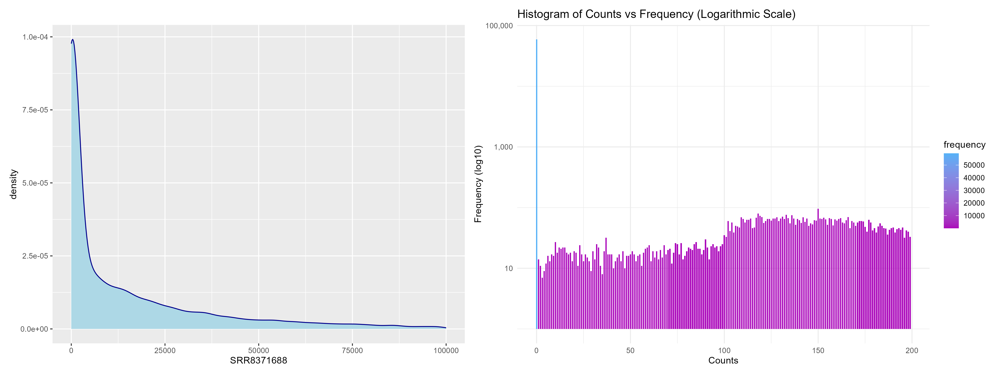
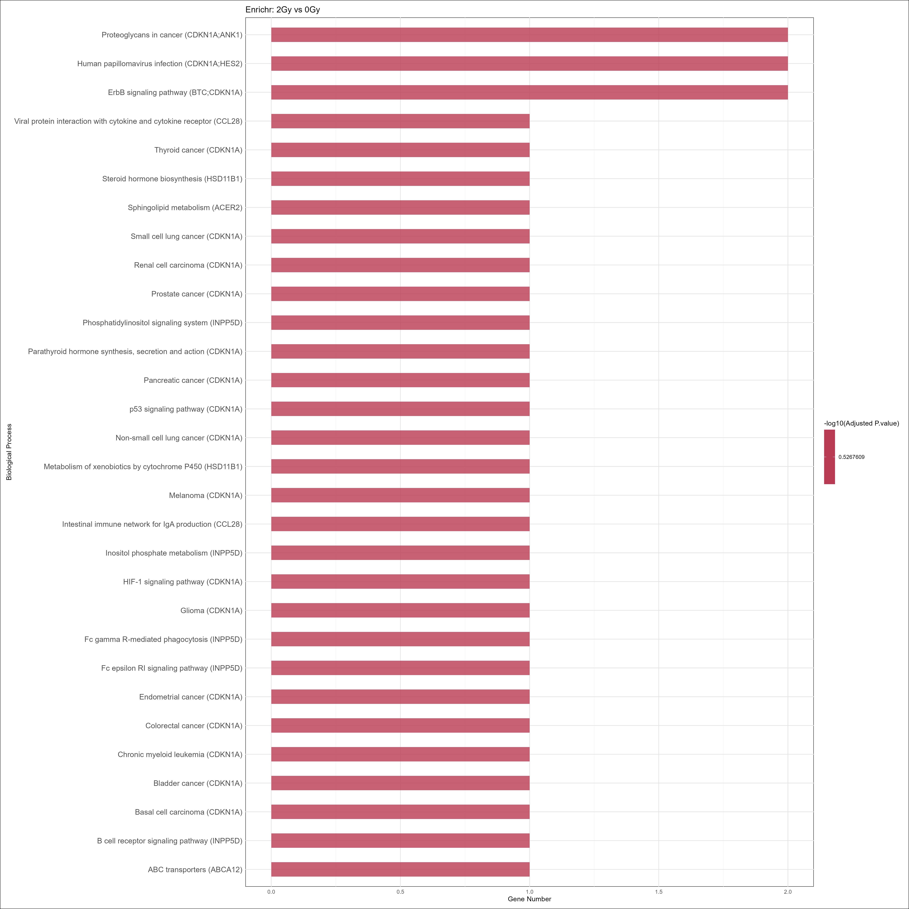
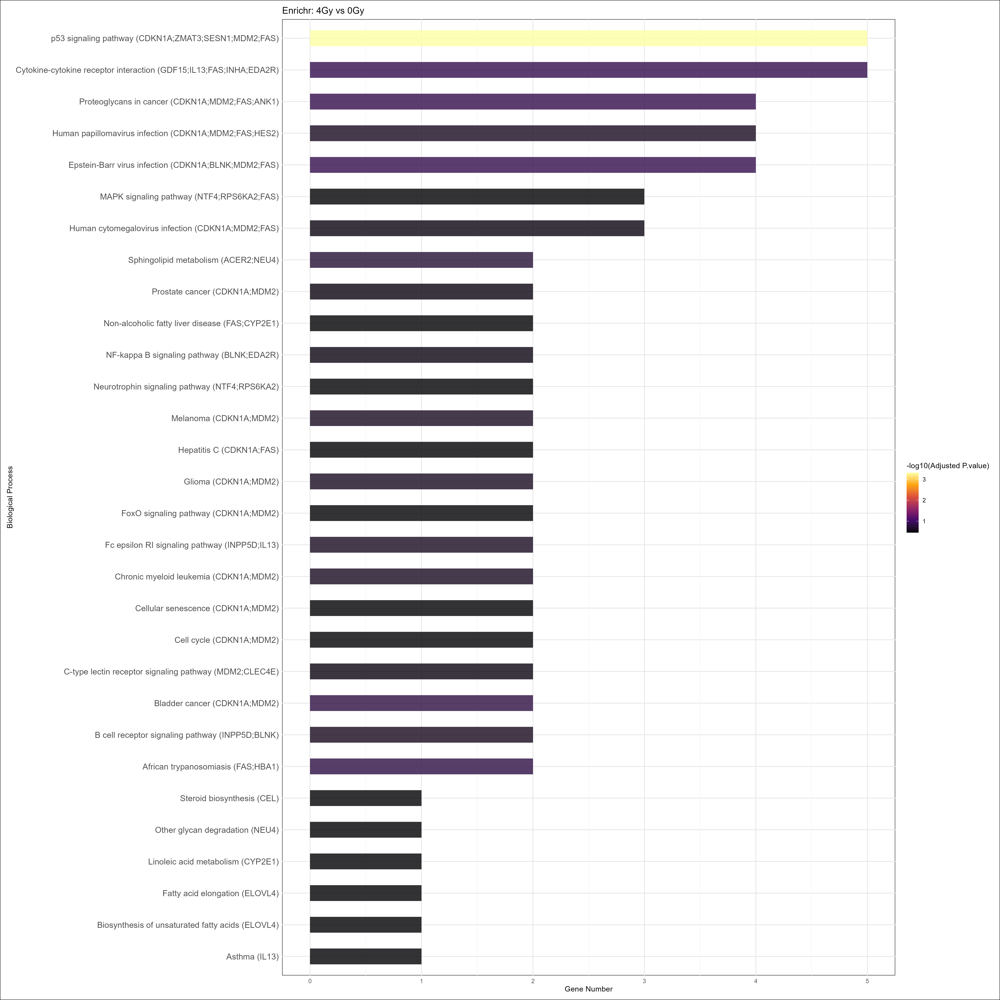

<p></p>
Виконавці: Данило Кравчук (завантаження даних, DESeq, Функц. аналіз)
           Лев Кравчук (PCA, Функц. аналіз)
<p></p>
<span style="font-size:24px;">[GitHub](https://github.com/NotNowD/2024-daad-project.git)</span>

```{r setup, include=FALSE}
knitr::opts_chunk$set(echo = TRUE)
```

```{r library, include=FALSE, error=FALSE, message=FALSE}
library(knitr)
library(readr)
library(tidyverse)
library(ggrepel)
library(patchwork)
library(grid)
library(pheatmap)
library(scales)
library(conflicted)
library(recount3)
library(DESeq2)
library(ashr)
library(EnhancedVolcano)
library(PCAtools)
library(cowplot)
library(ggplotify)
library(VennDetail)
library(enrichR)
library(KEGGREST)
library(pathview)
library(biomaRt)
library(patchwork)
library(ggfortify)

walk(c("select", "filter", "count", "rename"), ~ conflict_prefer(.x, "dplyr")) # walk з purr
```
# Мета
Для аналізу диференційної експресії генів було обрано клітини лінії А549 як біологічний об'єкт.
Клітини лінії A549 — це клітини недрібноклітинної (NSCLC) аденокарциноми легень.

# Завантаження даних

Дані було отримано з бази даних GEO (Gene Expression Omnibus). Завантажені дані описують експеримент з секвенуванням РНК (RNA-sequencing) на опромінених рентгенівським випромінюванням і контрольних клітинах A549.

Клітини A549 були піддані одноразовій дозі рентгенівського опромінення 2Гр або 4Гр за допомогою приладу X-RAD 160-225. Після опромінення клітини A549 (з одноразовою дозою опромінення), а також неопромінені клітини A549 були інкубовані ще 48 годин. Після цього було зібрано загальну РНК для високопродуктивного секвенування. 
Загальний дизайн експерименту: дослідження 3 умов по 3 репліки. Три групи: група 0Гр (контроль), група 2Гр та група 4Гр.

Відповідна стаття: doi: 10.1038/s41419-022-04561-x, PMID: 35190532.
```{r data, echo=FALSE, message=FALSE}
projects <- recount3::available_projects()

if ("SRP174505" %in% projects) {
  rse <- recount3::create_rse_manual(
    project = "SRP174505",
    project_home = "data_sources/sra",
    organism = "human",
    annotation = "gencode_v26",
    type = "gene"
  )
  
} else {
  rse <- recount3::create_rse_manual(
    project = "SRP174505",
    project_home = "data_sources/sra",
    organism = "human",
    annotation = "gencode_v26",
    type = "gene"
  )
}

rse_filtered <- rse[rowData(rse)$gene_type == "protein_coding", ]
```
## Дані експерименту та метадані {.tabset}

```{r rse export, include=FALSE, message=FALSE}
rse_colData<- as.data.frame(colData(rse))
rse_rowData<- as.data.frame(rowData(rse))
rse_assay <- as.data.frame(assay(rse))
rse_colData_f<- as.data.frame(colData(rse_filtered))
rse_rowData_f<- as.data.frame(rowData(rse_filtered))
rse_assay_f <- as.data.frame(assay(rse_filtered))
gene_annotations <- as.data.frame(rowData(rse_filtered)[c("gene_id", "gene_name")])
#gene_annotations_unique <- gene_annotations[!duplicated(gene_annotations$gene_name), ]
make_unique_names <- function(df, id_col, name_col) {
  df %>%
    rownames_to_column(var = id_col) %>%
    left_join(gene_annotations, by = id_col) %>%
    mutate(!!name_col := ifelse(is.na(.data[[name_col]]), .data[[id_col]], .data[[name_col]])) %>%
    mutate(!!name_col := make.unique(as.character(.data[[name_col]]))) %>%
    column_to_rownames(var = name_col)
}


write_delim(rse_colData, "./data/rse_colData.csv", delim = ";", col_names = TRUE)
write_delim(rse_rowData, "./data/rse_rowData.csv", delim = ";", col_names = TRUE)
write_delim(rse_assay, "./data/rse_assay.csv", delim = ";", col_names = TRUE)
write_delim(rse_colData_f, "./data/rse_colData_filtered.csv", delim = ";", col_names = TRUE)
write_delim(rse_rowData_f, "./data/rse_rowData_filtered.csv", delim = ";", col_names = TRUE)
write_delim(rse_assay_f, "./data/rse_assay_filtered.csv", delim = ";", col_names = TRUE)
```
### Метадані зразків {.tabset}
```{r}
kable(rse_colData_f |> 
  select(external_id, sra.study_title, sra.sample_title) |>  head(), format = "html", table.attr = "class='table table-striped'")
```
### Метадані генів {.tabset}
```{r}
kable(head(rse_rowData_f), format = "html", table.attr = "class='table table-striped'")
```
### Матриця експресії {.tabset}
```{r}
kable(rse_assay_f |> 
  arrange(desc(SRR8371688)) |> head(), format = "html", table.attr = "class='table table-striped'")
```


## Попередня візуалізація даних
Побудовано графік щільності для окремого зразка (SRR8371688) та гістограму частоти значень експресії
```{r pre-analysis visualisation, warning=FALSE}
# Створення таблиці метаданих
colData_new <- data.frame(
  row.names = colnames(rse_filtered),
  condition = factor(c(rep("0Gy", 3), rep("2Gy", 3), rep("4Gy", 3)))
)

# Матриця counts
countData <- assay(rse_filtered)

# Побудова графіку щільності
p1 <- ggplot(countData, aes(x = SRR8371688 )) +
  geom_density(color = "darkblue", fill = "lightblue") +
  xlim(0, 10e4)

count_summary <- countData |>
  as.vector() |>
  data.frame(counts = _) |>
  group_by(counts) |>
  summarise(frequency = n(), .groups = 'drop') |>
  arrange(counts)


# Створення гістограми частоти значень
p2 <- ggplot(count_summary[1:200,], aes(x = counts, y = frequency, fill = frequency)) +
  geom_bar(stat = "identity", width = 0.7) +
  scale_y_log10(labels = scales::comma) +
  labs(title = "Histogram of Counts vs Frequency (Logarithmic Scale)",
       x = "Counts",
       y = "Frequency (log10)") +
  scale_fill_gradient(low = "#AA05BA", high = "#56B1F7") +
  theme_minimal()
#p1
#p2
counts_info <- p1 + p2

ggsave("./figs/counts_info.png", plot = counts_info, width = 16, height = 6, dpi = 300)

```

```{r deseq, echo=FALSE, include=FALSE}
# Створіть DESeqDataSet
dds <- DESeqDataSetFromMatrix(countData = countData,
                              colData = colData_new,
                              design = ~ condition)
dds <- dds[apply(counts(dds), 1, function(row) all(row > 5)), ]
vsd <- vst(dds, blind = FALSE)

# Отримання матриці нормалізованих значень
vst_data <- assay(vsd)
```
# Аналіз диференційної експресії генів
## DESeq
Для аналізу диференційної експресії генів було застосовано DESeq Wald
```{r deseq_wald_test, echo=FALSE, message=FALSE}
dds_wald <- dds[rowSums(counts(dds)) > 0, ]

dds_wald <- DESeq(dds, test="Wald")
res_wald <- results(dds_wald)

#res_wald$padj <- p.adjust(res_wald$pvalue, method = "fdr")

res_sig_wald  <- res_wald[which(res_wald$padj < 0.05 & abs(res_wald$log2FoldChange) > 1.5), ]

res_wald_df <- as.data.frame(res_sig_wald )

# Додавання груп, виходячи з напрямку log2FoldChange
res_wald_df$condition <- ifelse(res_wald_df$log2FoldChange > 0, "Upregulated", "Downregulated")
head(res_wald_df) |> view()
# Побудова MA-графіка
pl2 <- ggplot(res_wald_df, aes(x = baseMean, y = log2FoldChange, color = condition)) +
  geom_point(alpha = 0.4, size = 1.5) +
  scale_x_log10() + 
  labs(x = "Mean of Normalized Counts", y = "Log2 Fold Change") +
  theme_minimal() +
  scale_color_manual(values = c("Upregulated" = "red", "Downregulated" = "blue")) +
  theme(
    legend.title = element_blank(),
    plot.background = element_rect(fill = "white"),
    panel.background = element_rect(fill = "white"))
#pl2
ggsave("./figs/deseq_wald_test.png", plot = pl2, width = 16, height = 6, dpi = 300)
```
## Коригування p.adj
Додатково було проведено коригування на хибний позитивний результат p.adj (FDR). Нижче наведено відповідний графік
```{r padj, message=FALSE, warning=FALSE}
res_wald_2Gy_vs_0Gy <- results(dds_wald, contrast = c("condition", "2Gy", "0Gy"))
res_wald_4Gy_vs_0Gy <- results(dds_wald, contrast = c("condition", "4Gy", "0Gy"))
res_wald_4Gy_vs_2Gy <- results(dds_wald, contrast = c("condition", "4Gy", "2Gy"))

hist_data_before <- bind_rows(
  data.frame(padj = res_wald_2Gy_vs_0Gy$padj, Comparison = "2Gy vs 0Gy"),
  data.frame(padj = res_wald_4Gy_vs_0Gy$padj, Comparison = "4Gy vs 0Gy"),
  data.frame(padj = res_wald_4Gy_vs_2Gy$padj, Comparison = "4Gy vs 2Gy")
)

res_wald_2Gy_vs_0Gy$padj <- p.adjust(res_wald_2Gy_vs_0Gy$pvalue, method = "fdr")
res_wald_4Gy_vs_0Gy$padj <- p.adjust(res_wald_4Gy_vs_0Gy$pvalue, method = "fdr")
res_wald_4Gy_vs_2Gy$padj <- p.adjust(res_wald_4Gy_vs_2Gy$pvalue, method = "fdr")

hist_data_after <- bind_rows(
  data.frame(padj = res_wald_2Gy_vs_0Gy$padj, Comparison = "2Gy vs 0Gy"),
  data.frame(padj = res_wald_4Gy_vs_0Gy$padj, Comparison = "4Gy vs 0Gy"),
  data.frame(padj = res_wald_4Gy_vs_2Gy$padj, Comparison = "4Gy vs 2Gy")
)

deseq_Wald_padj_b <- ggplot(hist_data_before, aes(x = padj, fill = Comparison, color = Comparison)) +
  geom_density(alpha = 0.2, adjust = 1.5) + # Криві густини
  scale_fill_manual(values = c("2Gy vs 0Gy" = "red", "4Gy vs 0Gy" = "blue", "4Gy vs 2Gy" = "forestgreen")) +
  scale_color_manual(values = c("2Gy vs 0Gy" = "red", "4Gy vs 0Gy" = "blue", "4Gy vs 2Gy" = "forestgreen")) +
  labs(title = "Розподіл коригованих p-значень", x = "p-значення", y = "Щільність") +
  geom_vline(xintercept = 0.05, linetype = "dashed", color = "black") +
  annotate("text", x = 0.05, y = Inf, label = "0.05", vjust = 1.5, hjust = -0.1, color = "black") +
  theme_minimal()

deseq_Wald_padj_a <- ggplot(hist_data_after, aes(x = padj, fill = Comparison, color = Comparison)) +
  geom_density(alpha = 0.2, adjust = 1.5) + # Криві густини
  scale_fill_manual(values = c("2Gy vs 0Gy" = "red", "4Gy vs 0Gy" = "blue", "4Gy vs 2Gy" = "forestgreen")) +
  scale_color_manual(values = c("2Gy vs 0Gy" = "red", "4Gy vs 0Gy" = "blue", "4Gy vs 2Gy" = "forestgreen")) +
  labs(title = "Розподіл коригованих p-значень", x = "p-значення", y = "Щільність") +
  geom_vline(xintercept = 0.05, linetype = "dashed", color = "black") +
  annotate("text", x = 0.05, y = Inf, label = "0.05", vjust = 1.5, hjust = -0.1, color = "black") +
  theme_minimal()

deseq_Wald_padj <- deseq_Wald_padj_b + deseq_Wald_padj_a
ggsave("./figs/deseq_Wald_padj.png", plot = deseq_Wald_padj, width = 16, height = 6, dpi = 300)
knitr::include_graphics("./figs/deseq_Wald_padj.png")
```

## Volcano plot {.tabset}
Для візуалізації у зміні експресії генів для випадку опромінення рентгеном 2Гр (порівняння з контролнм) та 4Гр  (порівняння з контролнм) побудовано volcano plot. Окремо проводилось порівняння експресії генів при опроміненні 2Гр та 4Гр.
```{r deseq visualization Wald, message=FALSE}

# png("./figs/deseq_Wald.png", width = 2400, height = 800)
# par(mfrow = c(1, 3), mar = c(5, 5, 4, 2))

# plotMA(res_wald_2Gy_vs_0Gy, ylim=c(-30,30), main="MA-plot: 0Gy vs 2Gy")
# plotMA(res_wald_4Gy_vs_0Gy, ylim=c(-30,30), main="MA-plot: 0Gy vs 4Gy")
# plotMA(res_wald_4Gy_vs_2Gy, ylim=c(-30,30), main="MA-plot: 2Gy vs 4Gy")
# dev.off()
# knitr::include_graphics("./figs/deseq_Wald.png")

res_wald_df_2Gy_vs_0Gy <- as.data.frame(res_wald_2Gy_vs_0Gy)
res_wald_df_2Gy_vs_0Gy$significant <- res_wald_df_2Gy_vs_0Gy$padj < 0.05

res_wald_df_4Gy_vs_0Gy <- as.data.frame(res_wald_4Gy_vs_0Gy)
res_wald_df_4Gy_vs_0Gy$significant <- res_wald_df_4Gy_vs_0Gy$padj < 0.05

res_wald_df_4Gy_vs_2Gy <- as.data.frame(res_wald_4Gy_vs_2Gy)
res_wald_df_4Gy_vs_2Gy$significant <- res_wald_df_4Gy_vs_2Gy$padj < 0.05

res_wald_df_2Gy_vs_0Gy$comparison <- "2Gy vs 0Gy"
res_wald_df_4Gy_vs_0Gy$comparison <- "4Gy vs 0Gy"
res_wald_df_4Gy_vs_2Gy$comparison <- "4Gy vs 2Gy"

res_wald_df_2Gy_vs_0Gy <- as.data.frame(res_wald_df_2Gy_vs_0Gy)  |> 
  mutate(gene_id = rownames(res_wald_df_2Gy_vs_0Gy), comparison = "2Gy vs 0Gy")  |> 
  left_join(gene_annotations, by = "gene_id")

# Оновлення res_df_4Gy_vs_0Gy
res_wald_df_4Gy_vs_0Gy <- as.data.frame(res_wald_df_4Gy_vs_0Gy)  %>% 
  mutate(gene_id = rownames(.), comparison = "4Gy vs 0Gy")  |> 
  left_join(gene_annotations, by = "gene_id")

# Оновлення res_df_4Gy_vs_2Gy
res_wald_df_4Gy_vs_2Gy <- as.data.frame(res_wald_df_4Gy_vs_2Gy)  |> 
  mutate(gene_id = rownames(res_wald_df_4Gy_vs_2Gy), comparison = "4Gy vs 2Gy")  |> 
  left_join(gene_annotations, by = "gene_id")

# Побудова volcano plot
plot_2Gy_vs_0Gy_W <- EnhancedVolcano(res_wald_df_2Gy_vs_0Gy,
                                   lab = res_wald_df_2Gy_vs_0Gy$gene_name,
                                   x = 'log2FoldChange',
                                   y = 'padj',
                                   xlim = c(-5, 5),
                                   ylim = c(0, 10),
                                   pCutoff = 0.05,
                                   FCcutoff = 1.5,
                                   pointSize = 5,
                                   labSize = 6,
                                   col = c('grey30', 'forestgreen', 'royalblue', 'red2'),
                                   title = '2Gy vs 0Gy',
                                   legendPosition = 'top')

plot_4Gy_vs_0Gy_W <- EnhancedVolcano(res_wald_df_4Gy_vs_0Gy,
                                   lab = res_wald_df_4Gy_vs_0Gy$gene_name,
                                   x = 'log2FoldChange',
                                   y = 'padj',
                                   xlim = c(-5, 5),
                                   ylim = c(0, 10),
                                   pCutoff = 0.05,
                                   FCcutoff = 1.5,
                                   pointSize = 5,
                                   labSize = 6,
                                   col = c('grey30', 'forestgreen', 'royalblue', 'red2'),
                                   title = '4Gy vs 0Gy',
                                   legendPosition = 'top')

plot_4Gy_vs_2Gy_W <- EnhancedVolcano(res_wald_df_4Gy_vs_2Gy,
                                   lab = res_wald_df_4Gy_vs_2Gy$gene_name,
                                   x = 'log2FoldChange',
                                   y = 'padj',
                                   xlim = c(-5, 5),
                                   ylim = c(0, 10),
                                   pCutoff = 0.05,
                                   FCcutoff = 1.5,
                                   pointSize = 5,
                                   labSize = 6,
                                   col = c('grey30', 'forestgreen', 'royalblue', 'red2'),
                                   title = '4Gy vs 2Gy',
                                   legendPosition = 'top')
volc_wald_plot <- plot_2Gy_vs_0Gy_W + plot_4Gy_vs_0Gy_W + plot_4Gy_vs_2Gy_W + plot_layout(nrow = 1)

#print(volc_wald_plot)
ggsave("./figs/volc_wald.png", plot = volc_wald_plot, width = 20, height = 6, dpi = 300)
```
### 2Gy vs 0Gy
```{r}
ggsave("./figs/volc_plot_2Gy_vs_0Gy.png", plot = plot_2Gy_vs_0Gy_W, width = 20, height = 20, dpi = 300)

```

### 4Gy vs 0Gy
```{r}
ggsave("./figs/volc_plot_4Gy_vs_0Gy.png", plot = plot_4Gy_vs_0Gy_W, width = 20, height = 20, dpi = 300)

```

### 4Gy vs 2Gy
```{r}
ggsave("./figs/volc_plot_4Gy_vs_2Gy.png", plot = plot_4Gy_vs_2Gy_W, width = 20, height = 20, dpi = 300)

```

## Upset
Для візуалізації перекриття між списками генів, які є статистично значущими (з коригованим p-значенням < 0.05) та мають великий зсув логарифмічних змін (log2FoldChange > 1.5 для підвищеної експресії та log2FoldChange < -1.5 для зниженої експресії) у різних порівняннях, використали upset plot.
```{r upset, results="hide", message=FALSE, warning=FALSE}
res_2Gy_0Gy_up <- res_wald_df_2Gy_vs_0Gy |> as.data.frame() |> filter(pvalue < 0.05 & log2FoldChange > 1.5)
res_2Gy_0Gy_down <- res_wald_df_2Gy_vs_0Gy  |> as.data.frame() |> filter(pvalue < 0.05 & log2FoldChange < -1.5)
res_4Gy_0Gy_up <- res_wald_df_4Gy_vs_0Gy  |> as.data.frame() |> filter(pvalue < 0.05 & log2FoldChange > 1.5)
res_4Gy_0Gy_down <- res_wald_df_4Gy_vs_0Gy  |> as.data.frame() |> filter(pvalue < 0.05 & log2FoldChange < -1.5)
res_4Gy_2Gy_up <- res_wald_df_4Gy_vs_2Gy |> as.data.frame() |> filter(pvalue < 0.05 & log2FoldChange > 1.5)
res_4Gy_2Gy_down <- res_wald_df_4Gy_vs_2Gy  |> as.data.frame() |> filter(pvalue < 0.05 & log2FoldChange < -1.5)

venn_list <- list("2Gy vs 0Gy(up)" = res_2Gy_0Gy_up$gene_name,
                  "2Gy vs 0Gy(down)" = res_2Gy_0Gy_down$gene_name,
                  "4Gy vs 0Gy(up)" = res_4Gy_0Gy_up$gene_name,
                  "4Gy vs 0Gy(down)" = res_4Gy_0Gy_down$gene_name,
                  "4Gy vs 2Gy(up)" = res_4Gy_2Gy_up$gene_name,
                  "4Gy vs 2Gy(down)" = res_4Gy_2Gy_down$gene_name)

ven <- venndetail(venn_list)

png("./figs/upset_diagram.png", width = 1600, height = 1600, res = 300)
plot(ven, type = "upset")
dev.off()
```
```{r, echo=FALSE}
knitr::include_graphics("./figs/upset_diagram.png")
```

# Аналіз головних компонент (PCA)
Наступним кроком було проведено PCA аналіз.

Scree plot <p></p>
Червона лінія відображає кумулятивну суму варіацій, яка показує, що 80% варіації даних припадає на п'ять головних компонент. При цьому PC1 пояснює близько 50% варіації. Для того, щоб визначити кількість головних компонент, які варто зберегти для аналізу були використані метод Горна та elbow, які зображені на графіку штриховою лінією.
У більшості випадків знайдені значення не збігатимуться. Це пов'язано з тим, що визначення правильної кількості головних компонент є складним завданням і визначення "правильної" кількості кластерів не існує.

Biplot <p></p>
Він комбінує інформацію про зразки і змінні в одному графіку. По осях зображені дві головні компоненти: PC1 і PC2, кожна з яких пояснює відсоток варіації в даних: PC1 — 44.98%, PC2 — 12.94%. Точки відповідають різним спостереженням за умов випромінювання X-хвилями 0Гр, 2Гр, 4Гр, які приблизно кластеризуються відповідно умовам впливу. Вектори представляють гени, які мають найбільший вплив на кожну компоненту. Напрям стрілки вказує, як експресія гену впливає на компоненти, а довжина — наскільки сильний цей вплив.

Щоб перевірити чи є "правильна" кластеризація експериментів, був проведений кластерний аналіз методом k-means з 5-ма головними компонентами, адже саме стільки компонент пояснюють більшу варіацію даних.

Щоб представити взаємодію між різними головними компонентами PC1, PC2, PC3, PC4, PC5, побудовано Pairs plot. На всіх графіках видно кластеризацію даних, але найліпше це спостерігається на парах PC1 - PC2-5 та PC2 - PC3-4.

Loadings plot <p></p>
Він показуює, наскільки кожен ген впливає на кожну головну компоненту. Це значення визначає, наскільки цей ген сприяє поясненню варіації в даних. Гени з високими позитивними або негативними завантаженнями мають найбільший внесок у головні компоненти та позначені фіолетовим та жовтим кольором відповідно.
```{r PCA, message=FALSE, warning=FALSE}

vst_data <- assay(vst(dds_wald))

pca_result <- PCAtools::pca(vst_data, metadata = colData_new, removeVar = 0.1)

horn <- parallelPCA(vst_data)
elbow <- findElbowPoint(pca_result$variance)
var_explained <- which(cumsum(pca_result$variance)> 80)[1]

pscree <- PCAtools::screeplot(pca_result,
    axisLabSize = 18,
    titleLabSize = 22,
    vline = c(horn$n, elbow, var_explained), hline = 85,
    returnPlot = FALSE) +
    geom_label(aes(x = horn$n, y = 60,
      label = 'Horn\'s', vjust = -1, size = 8)) +
    geom_label(aes(x = elbow, y = 60,
      label = 'Elbow method', vjust = -3, size = 8)) +
    geom_label(aes(x = var_explained , y = 85,
      label = '80% explained variation', vjust = -1, size = 8)) 


ppairs <- PCAtools::pairsplot(pca_result,
    hline = 0, vline = 0,
    pointSize = 2,
    gridlines.major = FALSE, gridlines.minor = FALSE,
    colby = 'condition',
    plotaxes = TRUE,
    margingaps = unit(c(0.01, 0.01, 0.01, 0.01), 'cm'),
    returnPlot = FALSE)


# Створюємо нові назви для рядків, зіставляючи gene_id з gene_name
new_row_names <- gene_annotations$gene_name[match(rownames(pca_result$loadings), gene_annotations$gene_id)]

# Якщо є дублікат імен, додамо індекси для унікальності
new_row_names <- make.unique(new_row_names)

# Перезаписуємо назви рядків у pca_result$loadings
rownames(pca_result$loadings) <- new_row_names


pbiplot <- PCAtools::biplot(pca_result,
    axisLabSize = 18,
    # loadings parameters
    showLoadings = TRUE,
    sizeLoadingsNames = 4,
    colLoadingsNames = 'red4',
    #points
    lab = NULL,
    colby = 'condition',
    colLegendTitle = 'Condition',
    colkey = c('0Gy' = '#228B22', '2Gy' = '#7B68EE', '4Gy' = '#FF8C00'),
    pointSize = 5,
    #plotview
    hline = 0,
    vline = c(-5, 0, 5),
    vlineType = c('dotdash', 'solid', 'dashed'),
    gridlines.major = FALSE, gridlines.minor = FALSE,
    legendPosition = 'right', 
    legendLabSize = 16,
    legendIconSize = 8.0,,
    subtitle = 'PC1 versus PC2',
    caption = '5 PCs ≈ 80%',
    returnPlot = FALSE)

ploadings <- PCAtools::plotloadings(pca_result,
    axisLabSize = 18,
    subtitle = 'PC1, PC2, PC3, PC4, PC5',
    labSize = 3,
    returnPlot = FALSE)

pca_df <- as.data.frame(pca_result$rotated)

# Додаємо інформацію про condition та інші метадані
pca_df$condition <- colData_new$condition

# Використовуємо більше компонент для кластеризації, наприклад, перші 5
set.seed(1234)
km <- kmeans(x = pca_df[, 1:5], centers = 3, nstart = 25)  # Використовуємо 5 компонент і 25 запусків
# Додаємо результати кластеризації в датафрейм
pca_df$cluster <- as.factor(km$cluster)

# Візуалізація
pkmean <- autoplot(km, data = pca_df, frame = TRUE, frame.type = 'norm', size = 4, alpha = 0.6) + 
  aes(shape = condition, color = cluster) + 
  scale_shape_manual(values = c('0Gy' = 16, '2Gy' = 17, '4Gy' = 18)) + 
  labs(subtitle = 'with 5 PCs',
       color = 'cluster', shape = 'Condition') +
  coord_equal() + 
  theme_minimal(base_size = 18)+
  theme(legend.position = 'right', # Позиція легенди
        panel.border = element_rect(color = 'black', fill = NA, size = 1))  # Додання рамки


# Додаємо заголовки до кожного графіка
pscree <- pscree + ggtitle("A Scree plot") + theme(plot.title = element_text(face = "bold", hjust = -0.01, size = 18))
ploadings <- ploadings + ggtitle("B Loading plot") + theme(plot.title = element_text(face = "bold", hjust = -0.01, size = 18))
pbiplot <- pbiplot + ggtitle("C Bi-plot") + theme(plot.title = element_text(face = "bold", hjust = -0.01, size = 18))
pkmean <- pkmean + ggtitle("D K-means Clusters") + theme(plot.title = element_text(face = "bold", hjust = -0.01, size = 18))
ppairs <- ppairs + ggtitle("E Pairs plot") + theme(plot.title = element_text(face = "bold", hjust = 0.5, size = 18))

# Комбінування графіків у сітку
combined_plot <- (pscree | ploadings) / (pbiplot | pkmean) / ppairs


ggsave("./figs/combined_plot.png", combined_plot, width = 20, height = 30)

knitr::include_graphics("./figs/combined_plot.png")
```

# Функціональний аналіз

Після проведення аналізу диференційної експресії було визначено роль цих генів в клітинах.
Для цього було проведено аналіз збагачення за допомогою Enrichr

## Функціональний аналіз Enrichr {.tabset}
```{r enrichr,echo=FALSE, include=FALSE,results="hide", message=FALSE, warning=FALSE}
dbs <- listEnrichrDbs()
# print(head(dbs))

databases <- c("KEGG_2021_Human", "GO_Biological_Process_2021", "Reactome_2022", "WikiPathways_2023_Human")

# enrichr_results_2Gy_0Gy_up <- enrichr(res_2Gy_0Gy_up$gene_name, databases)
# enrichr_results_4Gy_0Gy_up <- enrichr(res_4Gy_0Gy_up$gene_name, databases)
# enrichr_results_4Gy_2Gy_up <- enrichr(res_4Gy_2Gy_up$gene_name, databases)
# enrichr_results_all_up <- enrichr(unique(c(res_2Gy_0Gy_up$gene_name, res_4Gy_0Gy_up$gene_name, res_4Gy_2Gy_up$gene_name)), databases)

enrichr_results_2Gy_0Gy_up <- lapply(enrichr(res_2Gy_0Gy_up$gene_name, databases), function(x) head(x, 30))
enrichr_results_4Gy_0Gy_up <- lapply(enrichr(res_4Gy_0Gy_up$gene_name, databases), function(x) head(x, 30))
enrichr_results_4Gy_2Gy_up <- lapply(enrichr(res_4Gy_2Gy_up$gene_name, databases), function(x) head(x, 30))
enrichr_results_all_up <- lapply(enrichr(unique(c(res_2Gy_0Gy_up$gene_name, res_4Gy_0Gy_up$gene_name, res_4Gy_2Gy_up$gene_name)), databases), function(x) head(x, 30))

# # Збереження результатів у CSV-файли
# write.csv(enrichr_results_2Gy_0Gy_up, "./data/enrichr_results_2Gy_vs_0Gy_up.csv")
# write.csv(enrichr_results_4Gy_0Gy_up, "./data/enrichr_results_4Gy_vs_0Gy_up.csv")
# write.csv(enrichr_results_4Gy_2Gy_up, "./data/enrichr_results_4Gy_vs_2Gy_up.csv")

# Функція для підготовки даних і побудови графіка
plot_enrichr_barplot <- function(enrichr_result, title) {
  # Перетворюємо список результатів в датафрейм
  enrichr_result_df <- as.data.frame(enrichr_result[[1]])
  
  # Перетворення колонки Overlap з формату "x/y" в числовий (беремо перше число x)
  enrichr_result_df$Gene_number <- sapply(enrichr_result_df$Overlap, function(x) as.numeric(strsplit(x, "/")[[1]][1]))
  
  # Додаємо назви генів у дужках до терміна
  enrichr_result_df$Term <- paste0(enrichr_result_df$Term, " (", enrichr_result_df$Genes, ")")
  
  # Переконаємося, що є дані для побудови
  if (nrow(enrichr_result_df) > 0) {
    p <- ggplot(enrichr_result_df, aes(x = reorder(Term, Gene_number), 
                                  y = Gene_number, 
                                  fill = -log10(as.numeric(Adjusted.P.value)))) +
      geom_bar(stat = "identity", width = 0.5, alpha = 0.8) +
      coord_flip() +
      labs(title = title, 
           x = "Biological Process", 
           y = "Gene Number",
           fill = "-log10(Adjusted P.value)") +
      scale_fill_viridis_c(option = "inferno")  +
      theme_minimal() +
      theme(axis.text.y = element_text(size = 12),  # Розмір шрифта для заголовка легенди
            plot.margin = margin(10, 10, 10, 10),   # Збільшити відступи навколо графіка
            panel.background = element_rect(fill = "white"), # Білий фон панелі
            plot.background = element_rect(fill = "white"),  # Білий фон графіка
            panel.grid.major = element_line(color = "gray90"), # Колір основних сіток
            panel.grid.minor = element_line(color = "gray95"))  # Зменшити розмір шрифта на осі Y
    return(p)
  } else {
    print(paste("Немає даних для графіка:", title))
    return(NULL)
  }
}

# Побудуємо графіки для кожного результату
enrichr_results_2Gy_0Gy_up <- plot_enrichr_barplot(enrichr_results_2Gy_0Gy_up, "Enrichr: 2Gy vs 0Gy")
enrichr_results_4Gy_0Gy_up <- plot_enrichr_barplot(enrichr_results_4Gy_0Gy_up, "Enrichr: 4Gy vs 0Gy")
enrichr_results_4Gy_2Gy_up <- plot_enrichr_barplot(enrichr_results_4Gy_2Gy_up, "Enrichr: 4Gy vs 2Gy")
enrichr_results_all_up <- plot_enrichr_barplot(enrichr_results_all_up, "Enrichr: All Comparisons")

ggsave("./figs/enrichr_results_2Gy_0Gy_up.png", plot = enrichr_results_2Gy_0Gy_up, width = 20, height = 20, dpi = 300)
ggsave("./figs/enrichr_results_4Gy_0Gy_up.png", plot = enrichr_results_4Gy_0Gy_up, width = 20, height = 20, dpi = 300)
ggsave("./figs/enrichr_results_4Gy_2Gy_up.png", plot = enrichr_results_4Gy_2Gy_up, width = 20, height = 20, dpi = 300)
ggsave("./figs/enrichr_results_all_up.png", plot = enrichr_results_all_up, width = 20, height = 20, dpi = 300)
```

### Узагальнене {.tabset}
```{r}

```

### 2Gy 0Gy {.tabset}
```{r}

```

### 4Gy 0Gy {.tabset}
```{r}

```

### 4Gy 2Gy {.tabset}
```{r}

```


```{r ensembl, include=FALSE, echo=FALSE}
path_4Gy_vs_0Gy <- res_wald_df_4Gy_vs_0Gy  |> as.data.frame() |> filter(pvalue < 0.05 & abs(log2FoldChange) > 1.5)


# Отримуємо основні ENSEMBL IDs без версій і додаємо їх до DataFrame
path_4Gy_vs_0Gy$genes_of_interest <- gsub("\\..*", "", path_4Gy_vs_0Gy$gene_id)

# Встановлюємо біо-ресурс
ensembl <- useMart("ensembl", dataset = "hsapiens_gene_ensembl")

# Отримуємо Entrez IDs для основних ENSEMBL IDs
entrez_ids <- getBM(attributes = c('ensembl_gene_id', 'entrezgene_id'),
                    filters = 'ensembl_gene_id',
                    values = path_4Gy_vs_0Gy$genes_of_interest,
                    mart = ensembl)

# Об'єднуємо Entrez IDs з вашим DataFrame
path_4Gy_vs_0Gy <- merge(path_4Gy_vs_0Gy, entrez_ids, by.x = "genes_of_interest", by.y = "ensembl_gene_id", all.x = TRUE)


# Перевіряємо результати
head(path_4Gy_vs_0Gy)

```
## Аналіз метаболічних шляхів за допомогою Pathview {.tabset}
Для того, щоб явно побачити роль генів з підвищеною та зі зниженою експресією у клітинах лінії А549 було проведено аналіз метаболічних шляхів циклу клітини, проліферації, апоптозу.
```{r pathview, message=FALSE, warning=FALSE}
logFC <- path_4Gy_vs_0Gy$log2FoldChange
names(logFC) <- path_4Gy_vs_0Gy$entrezgene_id


pathview(gene.data = logFC, 
         pathway.id = "hsa05207", 
         species = "hsa", 
         #kegg.native = T
         ut.suffix = "Non-small cell lung cancer (специфічно для A549)")

pathview(gene.data = logFC, 
         pathway.id = "hsa04110", 
         species = "hsa", 
         #kegg.native = T
         ut.suffix = "Cell cycle")

pathview(gene.data = logFC, 
         pathway.id = "hsa04115", 
         species = "hsa", 
         #kegg.native = T
         ut.suffix = "p53 signaling pathway")

pathview(gene.data = logFC, 
         pathway.id = "hsa04725", 
         species = "hsa", 
         #kegg.native = T
         ut.suffix = "NAChR")

pathview(gene.data = logFC, 
         pathway.id = "hsa04210", 
         species = "hsa", 
         #kegg.native = T
         ut.suffix = "Apoptosis")
```


### Канцерогенез {.tabset}
```{r}
knitr::include_graphics("hsa05207.pathview.png")
```

Проліферація незважаючи на активацію RSK, загальний рівень клітинного поділу, ймовірно, знизиться через зменшення експресії генів E2F1 і CDC6.<p></p>
Виживання клітин буде зменшене, оскільки зниження рівнів Survivin і BCL2 сприяє збільшенню апоптозу.<p></p>
Апоптоз – ймовірно, підвищиться, через зниження активності антиапоптотичних білків (Survivin і BCL2).<p></p>
Загальний результат: фінально ми очікуємо зниження проліферації і виживання клітин із збільшенням апоптозу, що може мати позитивний вплив у контексті боротьби з раковими клітинами.


### Клітинний цикл {.tabset}
```{r}
knitr::include_graphics("hsa04110.pathview.png")
```

Проліферація значно знизиться, через зниження експресії багатьох генів, що регулюють клітинний цикл, реплікацію ДНК і мітоз (CycA/B, CDK1/2, Plk1, CDC20, E2F1-3, MCM, Dbf4).<p></p>
Виживання клітин частково збережеться, оскільки підвищена експресія Mdm2 може пригнічувати p53 і знижувати апоптоз.<p></p>
Апоптоз ймовірно, знизиться через пригнічення p53 шляхом підвищення Mdm2, хоча інші механізми можуть впливати на загальну картину.<p></p>
Загальний результат: значне зменшення клітинної проліферації через порушення ключових етапів клітинного циклу і реплікації, при цьому виживання клітин може залишитися відносно високим через інгібіцію апоптозу (Mdm2).


### р53 сигнальний шлях {.tabset}
```{r}
knitr::include_graphics("hsa04115.pathview.png")
```

Проліферація знизиться через активацію p21, зниження Cyclin B і B99, а також активність Sestrins, які інгібують проліферацію.<p></p>
Виживання клітин зменшиться через зниження Bcl-2 і активацію зовнішнього апоптозу через Fas.<p></p>
Апоптоз збільшиться через підвищену експресію Fas та PAG608, хоча MDM2 намагатиметься блокувати p53-опосередкований апоптоз.<p></p>
Загальний висновок: Проліферація клітин значно знизиться через затримку в клітинному циклі та пригнічення mTOR сигналінгу (через Sestrins), а апоптоз буде активований через Fas та інші проапоптотичні фактори.


### Апоптоз {.tabset}
```{r}
knitr::include_graphics("hsa04210.pathview.png")
```

Під впливом X-rays відбувається значний запуск апоптозу через активацію зовнішнього шляху (FAS/FASL) та ослаблення антиапоптичних сигналів (Bcl-2, IAPXIAP, Colfeyrin). Це призводить до масової клітинної загибелі.

### Холінергічний синапс {.tabset}
```{r}

```

Зниження рівня Bcl-2 робить клітини більш вразливими до апоптозу. <p></p>
Але якщо аплікувати нікотином nAChR, то це може стимулювати активацію сигнальних шляхів PI3K/Akt та MAPK, що стимулюють антиапоптичні сигнали та виживання клітин.<p></p>
 Загальний висновок: Навіть при зниженій експресії Bcl-2, активація PI3K/Akt шляхів через нікотин може частково компенсувати цей дефіцит, стимулюючи клітинні механізми виживання. Однак, без належного рівня Bcl-2, захист клітини буде ослабленим.

## {-}


